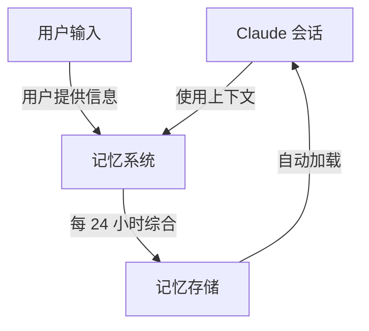
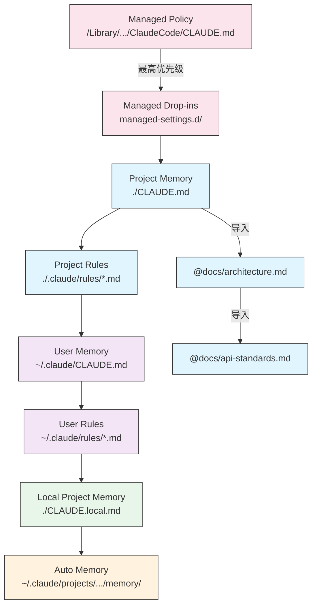
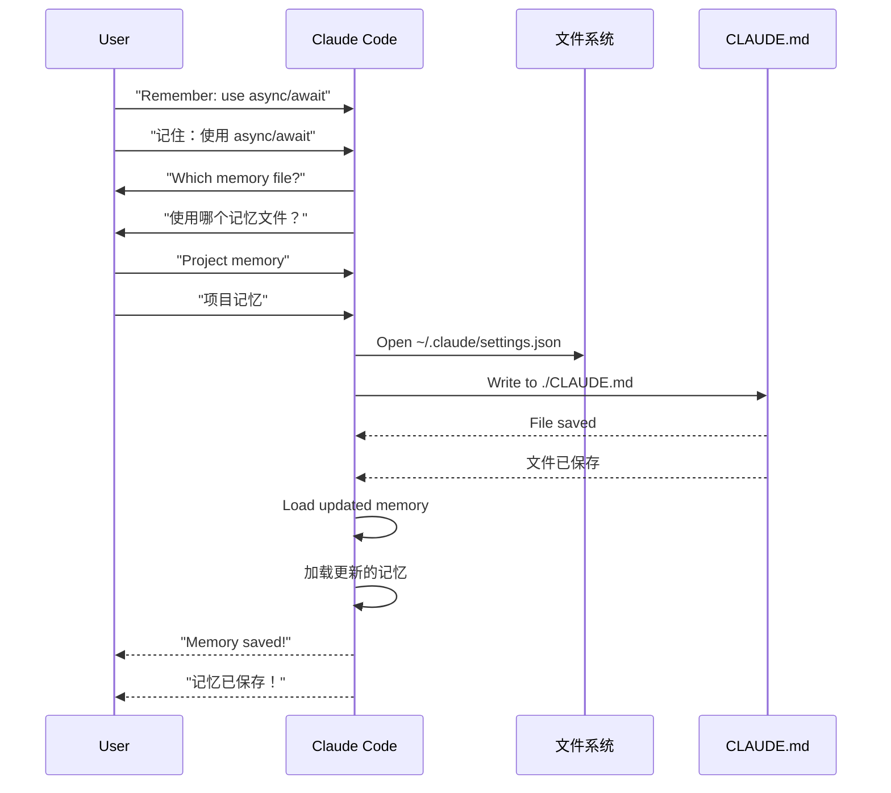
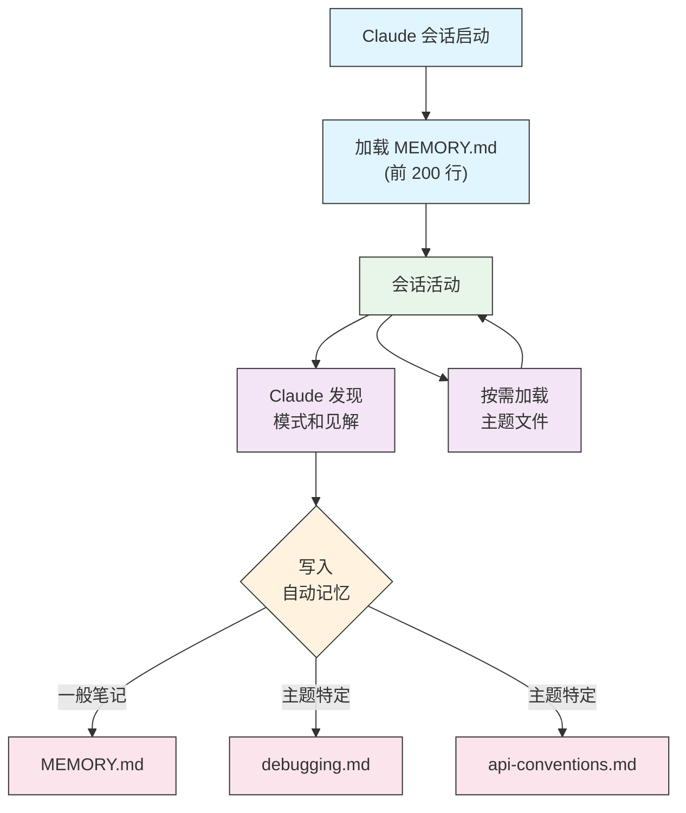

<picture>
  <source media="(prefers-color-scheme: dark)" srcset="../resources/logos/claude-howto-logo-dark.svg">
  
</picture>

# Memory 指南

Memory（记忆）功能使 Claude 能够在不同会话和对话之间保留上下文。它有两种形式：Claude.ai 上的自动综合，以及 Claude Code 中基于文件系统的 CLAUDE.md。

## 概述

Claude Code 中的 Memory 提供了跨多个会话和对话持久化的上下文。与临时上下文窗口不同，记忆文件允许你：

- 在团队中共享项目规范
- 存储个人开发偏好
- 维护特定目录的规则和配置
- 导入外部文档
- 将记忆作为项目的一部分进行版本控制

记忆系统运作在多个层级，从全局的个人偏好到特定的子目录，实现对 Claude 记忆内容和应用方式的细粒度控制。

## Memory 命令快速参考

| 命令 | 用途 | 用法 | 使用时机 |
|------|------|------|----------|
| `/init` | 初始化项目记忆 | `/init` | 启动新项目、首次设置 CLAUDE.md |
| `/memory` | 在编辑器中编辑记忆文件 | `/memory` | 大量更新、重组、查看内容 |
| `#` 前缀 | 快速单行记忆添加 | `# 你的规则` | 在对话中快速添加规则 |
| `# new rule into memory` | 显式记忆添加 | `# new rule into memory<br/>你的详细规则` | 添加复杂多行规则 |
| `# remember this` | 自然语言记忆 | `# remember this<br/>你的指令` | 对话式记忆更新 |
| `@path/to/file` | 导入外部内容 | `@README.md` 或 `@docs/api.md` | 在 CLAUDE.md 中引用现有文档 |

## 快速入门：初始化 Memory

### `/init` 命令

`/init` 命令是在 Claude Code 中设置项目记忆的最快方式。它会使用基础项目文档初始化一个 CLAUDE.md 文件。

**用法：**

```bash
/init
```

**功能：**

- 在你的项目中创建一个新的 CLAUDE.md 文件（通常位于 `./CLAUDE.md` 或 `./.claude/CLAUDE.md`）
- 建立项目约定和指南
- 为跨会话的上下文持久化奠定基础
- 提供用于记录项目标准的模板结构

**增强的交互模式：** 设置 `CLAUDE_CODE_NEW_INIT=true` 以启用多阶段交互流程，逐步引导你完成项目设置：

```bash
CLAUDE_CODE_NEW_INIT=true claude
/init
```

**何时使用 `/init`：**

- 使用 Claude Code 启动新项目
- 建立团队编码标准和约定
- 创建关于代码库结构的文档
- 为协作开发设置记忆层级

**示例工作流程：**

```markdown
# 在你的项目目录中
/init

# Claude 创建带有类似结构的 CLAUDE.md：
# 项目配置
## 项目概述
- 名称：你的项目
- 技术栈：[你的技术]
- 团队规模：[开发者数量]

## 开发标准
- 代码风格偏好
- 测试要求
- Git 工作流程约定
```

### 使用 `#` 进行快速记忆更新

你可以在任何对话中通过以 `#` 开头来快速向记忆添加信息：

**语法：**

```markdown
# 你的记忆规则或指令
```

**示例：**

```markdown
# 在这个项目中始终使用 TypeScript 严格模式

# 优先使用 async/await 而不是 Promise 链

# 每次提交前运行 npm test

# 文件名使用 kebab-case
```

**工作原理：**

1. 用 `#` 加上你的规则来开始你的消息
2. Claude 识别这是记忆更新请求
3. Claude 询问要更新哪个记忆文件（项目或个人信息）
4. 规则被添加到相应的 CLAUDE.md 文件
5. 未来的会话自动加载此上下文

**替代模式：**

```markdown
# new rule into memory
Always validate user input with Zod schemas
始终使用 Zod schema 验证用户输入

# remember this
Use semantic versioning for all releases
所有版本发布使用语义化版本控制

# add to memory
Database migrations must be reversible
数据库迁移必须可逆
```

### `/memory` 命令

`/memory` 命令提供对 Claude Code 会话中 CLAUDE.md 记忆文件的直接访问。它在你的系统编辑器中打开记忆文件。

**用法：**

```bash
/memory
```

**功能：**

- 在你的系统默认编辑器中打开记忆文件
- 允许你进行大量添加、修改和重组
- 提供对层级中所有记忆文件的直接访问
- 使你能够管理跨会话的持久化上下文

**何时使用 `/memory`：**

- 查看现有记忆内容
- 大量更新项目标准
- 重组记忆结构
- 添加详细文档或指南
- 随着项目发展维护和更新记忆

**对比：`/memory` vs `/init`**

| 方面 | `/memory` | `/init` |
|------|-----------|---------|
| **用途** | 编辑现有记忆文件 | 初始化新的 CLAUDE.md |
| **使用时机** | 更新/修改项目上下文 | 启动新项目 |
| **操作** | 打开编辑器进行修改 | 生成起始模板 |
| **工作流程** | 持续维护 | 一次性设置 |

**示例工作流程：**

```markdown
# 打开记忆进行编辑
/memory

# Claude 显示选项：
# 1. Managed Policy Memory
# 2. Project Memory (./CLAUDE.md)
# 3. User Memory (~/.claude/CLAUDE.md)
# 4. Local Project Memory

# 选择选项 2（项目记忆）
# 你的默认编辑器打开 ./CLAUDE.md 内容

# 进行修改，保存并关闭编辑器
# Claude 自动重新加载更新后的记忆
```

**使用记忆导入：**

CLAUDE.md 文件支持 `@path/to/file` 语法来包含外部内容：

```markdown
# 项目文档
See @README.md for project overview
请参阅 @README.md 了解项目概述
See @package.json for available npm commands
请参阅 @package.json 了解可用的 npm 命令
See @docs/architecture.md for system design
请参阅 @docs/architecture.md 了解系统设计

# Import from home directory using absolute path
使用绝对路径从主目录导入
@~/.claude/my-project-instructions.md
```

**导入功能：**

- 支持相对路径和绝对路径（例如 `@docs/api.md` 或 `@~/.claude/my-project-instructions.md`）
- 支持递归导入，最大深度为 5
- 首次从外部位置导入时会触发安全审批对话框
- 导入指令不在 markdown 代码片段或代码块中求值（因此在示例中记录它们是安全的）
- 通过引用现有文档帮助避免重复
- 自动将引用内容包含在 Claude 的上下文中

## Memory 架构

Claude Code 中的记忆遵循分层系统，不同作用域服务于不同目的：



## Claude Code 中的记忆层级

Claude Code 使用多层级分层记忆系统。记忆文件在 Claude Code 启动时自动加载，较高层级的文件优先。

**完整记忆层级（按优先级排序）：**

1. **Managed Policy（托管策略）** - 组织范围的指令
   - macOS：`/Library/Application Support/ClaudeCode/CLAUDE.md`
   - Linux/WSL：`/etc/claude-code/CLAUDE.md`
   - Windows：`C:\Program Files\ClaudeCode\CLAUDE.md`

2. **Managed Drop-ins（托管补充）** - 按字母顺序合并的策略文件（v2.1.83+）
   - 与托管策略 CLAUDE.md 同目录下的 `managed-settings.d/` 目录
   - 文件按字母顺序合并，用于模块化策略管理

3. **Project Memory（项目记忆）** - 团队共享的上下文（版本控制）
   - `./.claude/CLAUDE.md` 或 `./CLAUDE.md`（在仓库根目录）

4. **Project Rules（项目规则）** - 模块化、主题特定的项目指令
   - `./.claude/rules/*.md`

5. **User Memory（用户记忆）** - 个人偏好（所有项目）
   - `~/.claude/CLAUDE.md`

6. **User-Level Rules（用户级规则）** - 个人规则（所有项目）
   - `~/.claude/rules/*.md`

7. **Local Project Memory（本地项目记忆）** - 个人项目特定偏好
   - `./CLAUDE.local.md`

> **注意**：`CLAUDE.local.md` 未在 [官方文档](https://code.claude.com/docs/en/memory)（截至 2026 年 3 月）中提及。它可能仍然作为遗留功能使用。对于新项目，请考虑使用 `~/.claude/CLAUDE.md`（用户级）或 `.claude/rules/`（项目级、路径作用域）。

8. **Auto Memory（自动记忆）** - Claude 的自动笔记和学习
   - `~/.claude/projects/<project>/memory/`

**记忆发现行为：**

Claude 按以下顺序搜索记忆文件，较早的位置优先：



## 使用 `claudeMdExcludes` 排除 CLAUDE.md 文件

在大型 monorepo 中，某些 CLAUDE.md 文件可能与当前工作无关。`claudeMdExcludes` 设置允许你跳过特定的 CLAUDE.md 文件，使其不加载到上下文中：

```jsonc
// 在 ~/.claude/settings.json 或 .claude/settings.json 中
{
  "claudeMdExcludes": [
    "packages/legacy-app/CLAUDE.md",
    "vendors/**/CLAUDE.md"
  ]
}
```

模式与项目根目录的相对路径匹配。这对于以下情况特别有用：

- 包含多个子项目的 monorepo，其中只有部分相关
- 包含供应商或第三方 CLAUDE.md 文件的仓库
- 通过排除过时或不相关的指令来减少 Claude 上下文窗口中的噪音

## 设置文件层级

Claude Code 设置（包括 `autoMemoryDirectory`、`claudeMdExcludes` 和其他配置）从五级层级中解析，较高层级优先：

| 层级 | 位置 | 作用域 |
|------|------|--------|
| 1（最高） | 托管策略（系统级） | 组织范围强制执行 |
| 2 | `managed-settings.d/`（v2.1.83+） | 模块化策略补充，按字母顺序合并 |
| 3 | `~/.claude/settings.json` | 用户偏好 |
| 4 | `.claude/settings.json` | 项目级（提交到 git） |
| 5（最低） | `.claude/settings.local.json` | 本地覆盖（git 忽略） |

**平台特定配置（v2.1.51+）：**

设置也可以通过以下方式配置：
- **macOS**：属性列表（plist）文件
- **Windows**：Windows 注册表

这些平台原生机制与 JSON 设置文件一起读取，并遵循相同的优先级规则。

## 模块化规则系统

使用 `.claude/rules/` 目录结构创建有组织的、路径特定的规则。规则可以在项目级和用户级定义：

```
your-project/
├── .claude/
│   ├── CLAUDE.md
│   └── rules/
│       ├── code-style.md
│       ├── testing.md
│       ├── security.md
│       └── api/                  # 支持子目录
│           ├── conventions.md
│           └── validation.md

~/.claude/
├── CLAUDE.md
└── rules/                        # 用户级规则（所有项目）
    ├── personal-style.md
    └── preferred-patterns.md
```

规则在 `rules/` 目录中被递归发现，包括任何子目录。`~/.claude/rules/` 中的用户级规则在项目级规则之前加载，允许项目覆盖的个人默认值。

### 使用 YAML Frontmatter 的路径特定规则

定义仅适用于特定文件路径的规则：

```markdown
---
paths: src/api/**/*.ts
---

# API 开发规则

- 所有 API 端点必须包含输入验证
- 使用 Zod 进行 schema 验证
- 记录所有参数和响应类型
- 所有操作包含错误处理
```

**Glob 模式示例：**

- `**/*.ts` - 所有 TypeScript 文件
- `src/**/*` - src/ 下的所有文件
- `src/**/*.{ts,tsx}` - 多个扩展名
- `{src,lib}/**/*.ts, tests/**/*.test.ts` - 多个模式

### 子目录和符号链接

`.claude/rules/` 中的规则支持两种组织功能：

- **子目录**：规则被递归发现，因此你可以将它们组织成基于主题的文件夹（例如 `rules/api/`、`rules/testing/`、`rules/security/`）
- **符号链接**：支持符号链接以在多个项目之间共享规则。例如，你可以从中央位置将共享规则文件符号链接到每个项目的 `.claude/rules/` 目录中

## 记忆位置表

| 位置 | 作用域 | 优先级 | 共享 | 访问 | 适用于 |
|------|--------|--------|------|------|--------|
| `/Library/Application Support/ClaudeCode/CLAUDE.md`（macOS） | 托管策略 | 1（最高） | 组织 | 系统 | 公司范围策略 |
| `/etc/claude-code/CLAUDE.md`（Linux/WSL） | 托管策略 | 1（最高） | 组织 | 系统 | 组织标准 |
| `C:\Program Files\ClaudeCode\CLAUDE.md`（Windows） | 托管策略 | 1（最高） | 组织 | 系统 | 企业准则 |
| `managed-settings.d/*.md`（策略旁边） | 托管补充 | 1.5 | 组织 | 系统 | 模块化策略文件（v2.1.83+） |
| `./CLAUDE.md` 或 `./.claude/CLAUDE.md` | 项目记忆 | 2 | 团队 | Git | 团队标准、共享架构 |
| `./.claude/rules/*.md` | 项目规则 | 3 | 团队 | Git | 路径特定、模块化规则 |
| `~/.claude/CLAUDE.md` | 用户记忆 | 4 | 个人 | 文件系统 | 个人偏好（所有项目） |
| `~/.claude/rules/*.md` | 用户规则 | 5 | 个人 | 文件系统 | 个人规则（所有项目） |
| `./CLAUDE.local.md` | 本地项目 | 6 | 个人 | Git（忽略） | 个人项目特定偏好 |
| `~/.claude/projects/<project>/memory/` | 自动记忆 | 7（最低） | 个人 | 文件系统 | Claude 的自动笔记和学习 |

## 记忆更新生命周期

以下是记忆更新如何流经你的 Claude Code 会话：



## Auto Memory

Auto Memory（自动记忆）是一个持久化目录，Claude 会在与你的项目合作时自动记录学习内容、模式和见解。与你手动编写和维护的 CLAUDE.md 文件不同，自动记忆由 Claude 在会话期间自行编写。

### 自动记忆如何工作

- **位置**：`~/.claude/projects/<project>/memory/`
- **入口点**：`MEMORY.md` 作为自动记忆目录中的主文件
- **主题文件**：可选的特定主题附加文件（例如 `debugging.md`、`api-conventions.md`）
- **加载行为**：`MEMORY.md` 的前 200 行在会话开始时加载到系统提示中。主题文件按需加载，不在启动时加载。
- **读/写**：Claude 在会话期间读取和写入记忆文件，因为它会发现模式和项目特定知识

### 自动记忆架构



### 自动记忆目录结构

```
~/.claude/projects/<project>/memory/
├── MEMORY.md              # 入口点（启动时加载前 200 行）
├── debugging.md           # 主题文件（按需加载）
├── api-conventions.md     # 主题文件（按需加载）
└── testing-patterns.md    # 主题文件（按需加载）
```

### 版本要求

自动记忆需要 **Claude Code v2.1.59 或更高版本**。如果你使用的是旧版本，请先升级：

```bash
npm install -g @anthropic-ai/claude-code@latest
```

### 自定义自动记忆目录

默认情况下，自动记忆存储在 `~/.claude/projects/<project>/memory/`。你可以使用 `autoMemoryDirectory` 设置更改此位置（自 **v2.1.74** 起可用）：

```jsonc
// 在 ~/.claude/settings.json 或 .claude/settings.local.json 中（仅用户/本地设置）
{
  "autoMemoryDirectory": "/path/to/custom/memory/directory"
}
```

> **注意**：`autoMemoryDirectory` 只能在用户级（`~/.claude/settings.json`）或本地设置（`.claude/settings.local.json`）中设置，不能在项目或托管策略设置中设置。

这在你想要以下情况时很有用：

- 将自动记忆存储在共享或同步位置
- 将自动记忆与默认 Claude 配置目录分开
- 使用项目特定路径在默认层级之外

### Worktree 和仓库共享

同一 git 仓库中的所有 worktree 和子目录共享一个自动记忆目录。这意味着在 worktree 之间切换或在同一个仓库的不同子目录中工作将读写相同的记忆文件。

### 子代理记忆

子代理（通过 Task 或并行执行等工具生成）可以有自己的记忆上下文。在子代理定义中使用 `memory` frontmatter 字段指定要加载哪些记忆作用域：

```yaml
memory: user      # 仅加载用户级记忆
memory: project   # 仅加载项目级记忆
memory: local     # 仅加载本地记忆
```

这允许子代理使用专注的上下文操作，而不是继承完整的记忆层级。

### 控制自动记忆

自动记忆可以通过 `CLAUDE_CODE_DISABLE_AUTO_MEMORY` 环境变量控制：

| 值 | 行为 |
|----|------|
| `0` | 强制开启自动记忆 |
| `1` | 强制关闭自动记忆 |
| *（未设置）* | 默认行为（启用自动记忆） |

```bash
# 为会话禁用自动记忆
CLAUDE_CODE_DISABLE_AUTO_MEMORY=1 claude

# 明确强制开启自动记忆
CLAUDE_CODE_DISABLE_AUTO_MEMORY=0 claude
```

## 使用 `--add-dir` 添加额外目录

`--add-dir` 标志允许 Claude Code 从当前工作目录之外的额外目录加载 CLAUDE.md 文件。这对于 monorepo 或多项目设置很有用，在这些设置中，来自其他目录的上下文是相关的。

要启用此功能，请设置环境变量：

```bash
CLAUDE_CODE_ADDITIONAL_DIRECTORIES_CLAUDE_MD=1
```

然后使用该标志启动 Claude Code：

```bash
claude --add-dir /path/to/other/project
```

Claude 将从指定的额外目录加载 CLAUDE.md，以及当前工作目录的记忆文件。

## 实践示例

### 示例 1：项目记忆结构

**文件：** `./CLAUDE.md`

```markdown
# 项目配置

## 项目概述
- **名称**：电商平台
- **技术栈**：Node.js、PostgreSQL、React 18、Docker
- **团队规模**：5 名开发人员
- **截止日期**：2025 年第四季度

## 架构文档
@docs/architecture.md
@docs/api-standards.md
@docs/database-schema.md

## 开发规范

### 代码风格
- 使用 Prettier 进行代码格式化
- 使用 ESLint 配合 Airbnb 配置
- 最大行长度：100 个字符
- 使用 2 空格缩进

### 命名规范
- **文件**：kebab-case（user-controller.js）
- **类**：PascalCase（UserService）
- **函数/变量**：camelCase（getUserById）
- **常量**：UPPER_SNAKE_CASE（API_BASE_URL）
- **数据库表**：snake_case（user_accounts）

### Git 工作流程
- 分支命名：`feature/描述` 或 `fix/描述`
- 提交信息：遵循 Conventional Commits 规范
- 必须通过 PR 才能合并
- 所有 CI/CD 检查必须通过
- 至少需要 1 人审批

### 测试要求
- 最低代码覆盖率：80%
- 所有关键路径必须编写测试
- 使用 Jest 进行单元测试
- 使用 Cypress 进行端到端测试
- 测试文件名：`*.test.ts` 或 `*.spec.ts`

### API 规范
- 仅使用 RESTful 端点
- 使用 JSON 格式的请求/响应
- 正确使用 HTTP 状态码
- API 端点版本控制：`/api/v1/`
- 所有端点必须附带示例文档

### 数据库
- 使用迁移工具管理 schema 变更
- 禁止硬编码凭据
- 使用连接池
- 开发环境启用查询日志
- 必须定期备份

### 部署
- 基于 Docker 部署
- 使用 Kubernetes 进行编排
- 蓝绿部署策略
- 失败时自动回滚
- 数据库迁移在部署前运行

## 常用命令

| 命令 | 用途 |
|------|------|
| `npm run dev` | 启动开发服务器 |
| `npm test` | 运行测试套件 |
| `npm run lint` | 检查代码风格 |
| `npm run build` | 构建生产版本 |
| `npm run migrate` | 运行数据库迁移 |

## 团队联系方式
- 技术负责人：Sarah Chen（@sarah.chen）
- 产品经理：Mike Johnson（@mike.j）
- 运维工程师：Alex Kim（@alex.k）

## 已知问题及解决方案
- 峰值时段 PostgreSQL 连接池限制为 20
  - 解决方案：实现查询队列
- Safari 14 与异步生成器兼容性问题
  - 解决方案：使用 Babel 转译器

## 相关项目
- 数据分析面板：`/projects/analytics`
- 移动端应用：`/projects/mobile`
- 管理后台：`/projects/admin`
```

### 示例 2：目录特定记忆

**文件：** `./src/api/CLAUDE.md`

```markdown
# API 模块规范

此文件覆盖根目录的 CLAUDE.md，对 `/src/api/` 目录下的所有内容生效。

## API 特定规范

### 请求验证
- 使用 Zod 进行 schema 验证
- 必须验证所有输入
- 验证错误时返回 400 状态码
- 包含字段级别的错误详情

### 身份认证
- 所有端点都需要 JWT 令牌
- 令牌放在 Authorization 请求头中
- 令牌 24 小时后过期
- 实现刷新令牌机制

### 响应格式

所有响应必须遵循以下结构：

```json
{
  "success": true,
  "data": { /* 实际数据 */ },
  "timestamp": "2025-11-06T10:30:00Z",
  "version": "1.0"
}
```

错误响应：
```json
{
  "success": false,
  "error": {
    "code": "VALIDATION_ERROR",
    "message": "用户消息",
    "details": { /* 字段错误 */ }
  },
  "timestamp": "2025-11-06T10:30:00Z"
}
```

### 分页
- 使用游标分页（而非偏移量分页）
- 包含 `hasMore` 布尔值
- 最大页面大小限制为 100
- 默认页面大小：20

### 速率限制
- 已认证用户：每小时 1000 次请求
- 公开端点：每小时 100 次请求
- 超出限制时返回 429
- 包含 retry-after 响应头

### 缓存
- 使用 Redis 进行会话缓存
- 默认缓存时长：5 分钟
- 写操作时清除缓存
- 使用资源类型标记缓存键
```

### 示例 3：个人记忆

**文件：** `~/.claude/CLAUDE.md`

```markdown
# 我的开发偏好

## 关于我
- **经验水平**：8 年全栈开发经验
- **偏好语言**：TypeScript、Python
- **沟通风格**：直接，提供示例
- **学习风格**：图表结合代码

## 代码偏好

### 错误处理
我偏好使用 try-catch 块进行显式错误处理，并提供有意义的错误信息。
避免使用通用错误。请务必记录错误以便调试。

### 注释
注释用于说明"为什么"，而不是"是什么"。代码应该做到自我文档化。
注释应该解释业务逻辑或非显而易见的决策。

### 测试
我偏好 TDD（测试驱动开发）。
先写测试，再写实现。
关注行为，而非实现细节。

### 架构
我偏好模块化、低耦合的设计。
使用依赖注入以提高可测试性。
分离关注点（Controller、Service、Repository）。

## 调试偏好
- 使用带前缀的 console.log：`[DEBUG]`
- 包含上下文：函数名、相关变量
- 尽可能使用堆栈跟踪
- 日志中始终包含时间戳

## 沟通
- 使用图表解释复杂概念
- 在解释理论之前先展示具体示例
- 包含前/后代码对比片段
- 最后总结要点

## 项目组织
我的项目组织结构如下：

   project/
   ├── src/
   │   ├── api/
   │   ├── services/
   │   ├── models/
   │   └── utils/
   ├── tests/
   ├── docs/
   └── docker/

## 工具
- **IDE**：VS Code 配合 Vim 键位
- **终端**：Zsh 配合 Oh-My-Zsh
- **格式化**：Prettier（行长度 100 字符）
- **代码检查**：ESLint 配合 Airbnb 配置
- **测试框架**：Jest 配合 React Testing Library
```

_My Test_
请 Claude 保存新规则


Claude 尚未保存规则，因为我还没有在任何地方创建 `Claude.md` 文件。然后请 Claude 确认位置。


### 示例 4：会话期间更新记忆

你可以在活动的 Claude Code 会话中向记忆添加新规则。有两种方法：

#### 方法 1：直接请求

```markdown
User: Remember that I prefer using React hooks instead of class components
     for all new components.
用户：记住我更喜欢在新组件中使用 React hooks 而不是 class 组件。

Claude: I'm adding that to your memory. Which memory file should this go in?
Claude：我将其添加到你的记忆中。应该放在哪个记忆文件中？
        1. Project memory (./CLAUDE.md)
        2. Personal memory (~/.claude/CLAUDE.md)

User: Project memory
用户：项目记忆

Claude: ✅ Memory saved!
Claude：✅ 记忆已保存！

Added to ./CLAUDE.md:
添加到 ./CLAUDE.md：

---

### Component Development
### 组件开发
- Use functional components with React Hooks
使用 React Hooks 的函数式组件
- Prefer hooks over class components
优先使用 hooks 而非 class 组件
- Custom hooks for reusable logic
使用自定义 hooks 实现可复用逻辑
- Use useCallback for event handlers
事件处理程序使用 useCallback
- Use useMemo for expensive computations
昂贵计算使用 useMemo
```

#### 方法 2：使用"# new rule into memory"模式

你也可以使用显式模式 "# new rule into memory" 来触发记忆更新：

```markdown
User: # new rule into memory
用户：# new rule into memory
      Always validate user input with Zod schemas before processing.
      始终使用 Zod schema 在处理前验证用户输入。

Claude: I'm saving this rule to memory. Which memory file should I use?
Claude：我正在将此规则保存到记忆中。我应该使用哪个记忆文件？
        1. Project memory (./CLAUDE.md)
        2. Personal memory (~/.claude/CLAUDE.md)

User: Project memory
用户：项目记忆

Claude: ✅ Memory saved!
Claude：✅ 记忆已保存！

Added to ./CLAUDE.md:
添加到 ./CLAUDE.md：

---

### Input Validation
### 输入验证
- Always validate user input with Zod schemas before processing
始终使用 Zod schema 在处理前验证用户输入
- Define schemas at the top of each API handler file
在每个 API 处理程序文件顶部定义 schema
- Return 400 status with validation errors
返回 400 状态码并附带验证错误
```

#### 添加记忆的技巧

- 规则要具体且可操作
- 将相关规则分组在同一节标题下
- 更新现有部分而非重复内容
- 选择适当的记忆作用域（项目 vs. 个人）

## 记忆功能对比

| 功能 | Claude Web/桌面版 | Claude Code（CLAUDE.md） |
|------|-----------------|------------------------|
| 自动综合 | ✅ 每 24 小时 | ❌ 手动 |
| 跨项目 | ✅ 共享 | ❌ 项目特定 |
| 团队访问 | ✅ 共享项目 | ✅ Git 跟踪 |
| 可搜索 | ✅ 内置 | ✅ 通过 `/memory` |
| 可编辑 | ✅ 聊天内 | ✅ 直接编辑文件 |
| 导入/导出 | ✅ 支持 | ✅ 复制粘贴 |
| 持久化 | ✅ 24 小时+ | ✅ 无限期 |

### Claude Web/桌面版中的记忆

#### 记忆综合时间线


**记忆摘要示例：**

```markdown
## Claude 对用户的记忆

### 专业背景
- 8 年经验的高级全栈开发人员
- 专注于 TypeScript/Node.js 后端和 React 前端
- 活跃的开源贡献者
- 对 AI 和机器学习感兴趣

### 项目上下文
- 当前构建电商平台
- 技术栈：Node.js、PostgreSQL、React 18、Docker
- 与 5 名开发人员组成的团队合作
- 使用 CI/CD 和蓝绿部署

### 沟通偏好
- 偏好直接、简洁的解释
- 喜欢图表和示例
- 欣赏代码片段
- 在注释中解释业务逻辑

### 当前目标
- 改进 API 性能
- 将测试覆盖率提高到 90%
- 实现缓存策略
- 记录架构
```

## 最佳实践

### 应该做 - 应包含的内容

- **要具体和详细**：使用清晰、详细的指令而非模糊的指导
  - ✅ 好："所有 JavaScript 文件使用 2 空格缩进"
  - ❌ 避免："遵循最佳实践"

- **保持有条理**：用清晰的 markdown 部分和标题组织记忆文件

- **使用适当的层级**：
  - **托管策略**：公司范围策略、安全标准、合规要求
  - **项目记忆**：团队标准、架构、编码约定（提交到 git）
  - **用户记忆**：个人偏好、沟通风格、工具选择
  - **目录记忆**：模块特定规则和覆盖

- **利用导入**：使用 `@path/to/file` 语法引用现有文档
  - 支持最多 5 级递归嵌套
  - 避免记忆文件之间的重复
  - 示例：`See @README.md for project overview`

- **记录常用命令**：包含你重复使用的命令以节省时间

- **版本控制项目记忆**：将项目级 CLAUDE.md 文件提交到 git 以造福团队

- **定期审查**：随着项目发展和需求变化定期更新记忆

- **提供具体示例**：包含代码片段和具体场景

### 不应该做 - 应避免的内容

- **不要存储密钥**：永不包含 API 密钥、密码、令牌或凭据

- **不要包含敏感数据**：不包含 PII、私人信息或专有密钥

- **不要重复内容**：使用导入（`@path`）引用现有文档而非复制

- **不要含糊不清**：避免"遵循最佳实践"或"编写好代码"等通用陈述

- **不要让它太长**：保持单个记忆文件专注且在 500 行以内

- **不要过度组织**：战略性地使用层级；不要创建过多的子目录覆盖

- **不要忘记更新**：过时的记忆会导致混淆和过时的实践

- **不要超过嵌套限制**：记忆导入支持最多 5 级嵌套

### 记忆管理技巧

**选择正确的记忆级别：**

| 使用场景 | 记忆级别 | 理由 |
|----------|---------|------|
| 公司安全策略 | 托管策略 | 适用于所有项目，组织范围 |
| 团队代码风格指南 | 项目 | 通过 git 与团队共享 |
| 你喜欢的编辑器快捷键 | 用户 | 个人偏好，不共享 |
| API 模块标准 | 目录 | 仅适用于该模块 |

**快速更新工作流程：**

1. 对于单个规则：在对话中使用 `#` 前缀
2. 对于多个更改：使用 `/memory` 打开编辑器
3. 对于初始设置：使用 `/init` 创建模板

**导入最佳实践：**

```markdown
# 好：引用现有文档
@README.md
@docs/architecture.md
@package.json

# 避免：复制其他地方存在的内容
# 不要将 README 内容复制到 CLAUDE.md 中，只需导入它
```

## 安装说明

### 设置项目记忆

#### 方法 1：使用 `/init` 命令（推荐）

设置项目记忆的最快方式：

1. **导航到你的项目目录：**
   ```bash
   cd /path/to/your/project
   ```

2. **在 Claude Code 中运行 init 命令：**
   ```bash
   /init
   ```

3. **Claude 将创建并填充 CLAUDE.md**，其中包含模板结构

4. **根据你的项目需求自定义生成的文件**

5. **提交到 git：**
   ```bash
   git add CLAUDE.md
   git commit -m "Initialize project memory with /init"
   ```

#### 方法 2：手动创建

如果你偏好手动设置：

1. **在你的项目根目录创建 CLAUDE.md：**
   ```bash
   cd /path/to/your/project
   touch CLAUDE.md
   ```

2. **添加项目标准：**
   ```bash
   cat > CLAUDE.md << 'EOF'
   # 项目配置

   ## 项目概述
   - **名称**：你的项目名称
   - **技术栈**：你的技术列表
   - **团队规模**：开发者数量

   ## 开发标准
   - 你的编码标准
   - 命名约定
   - 测试要求
   EOF
   ```

3. **提交到 git：**
   ```bash
   git add CLAUDE.md
   git commit -m "Add project memory configuration"
   ```

#### 方法 3：使用 `#` 快速更新

一旦 CLAUDE.md 存在，在对话中快速添加规则：

```markdown
# 所有版本发布使用语义化版本控制

# 提交前始终运行测试

# 优先使用组合而非继承
```

Claude 会提示你选择要更新的记忆文件。

### 设置个人记忆

1. **创建 ~/.claude 目录：**
   ```bash
   mkdir -p ~/.claude
   ```

2. **创建个人 CLAUDE.md：**
   ```bash
   touch ~/.claude/CLAUDE.md
   ```

3. **添加你的偏好：**
   ```bash
   cat > ~/.claude/CLAUDE.md << 'EOF'
   # 我的开发偏好

   ## 关于我
   - 经验水平：[你的水平]
   - 偏好语言：[你的语言]
   - 沟通风格：[你的风格]

   ## 代码偏好
   - [你的偏好]
   EOF
   ```

### 设置目录特定记忆

1. **为特定目录创建记忆：**
   ```bash
   mkdir -p /path/to/directory/.claude
   touch /path/to/directory/CLAUDE.md
   ```

2. **添加目录特定规则：**
   ```bash
   cat > /path/to/directory/CLAUDE.md << 'EOF'
   # [目录名称] 标准

   此文件覆盖该目录的根目录 CLAUDE.md。

   ## [特定标准]
   EOF
   ```

3. **提交到版本控制：**
   ```bash
   git add /path/to/directory/CLAUDE.md
   git commit -m "Add [directory] memory configuration"
   ```

### 验证设置

1. **检查记忆位置：**
   ```bash
   # 项目根目录记忆
   ls -la ./CLAUDE.md

   # 个人记忆
   ls -la ~/.claude/CLAUDE.md
   ```

2. **Claude Code 会在启动会话时自动加载**这些文件

3. **用 Claude Code 测试**，在你的项目中启动新会话

## 官方文档

有关最新信息，请参阅官方 Claude Code 文档：

- **[Memory 文档](https://code.claude.com/docs/en/memory)** - 完整记忆系统参考
- **[Slash 命令参考](https://code.claude.com/docs/en/interactive-mode)** - 所有内置命令，包括 `/init` 和 `/memory`
- **[CLI 参考](https://code.claude.com/docs/en/cli-reference)** - 命令行接口文档

### 官方文档的关键技术细节

**记忆加载：**

- Claude Code 启动时会自动加载所有记忆文件
- Claude 从当前工作目录向上遍历以发现 CLAUDE.md 文件
- 子目录文件在访问这些目录时按上下文被发现和加载

**导入语法：**

- 使用 `@path/to/file` 包含外部内容（例如 `@~/.claude/my-project-instructions.md`）
- 支持相对路径和绝对路径
- 支持递归导入，最大深度为 5
- 首次外部导入会触发审批对话框
- 不在 markdown 代码片段或代码块中求值
- 自动将引用内容包含在 Claude 的上下文中

**记忆层级优先级：**

1. 托管策略（最高优先级）
2. 托管补充（`managed-settings.d/`，v2.1.83+）
3. 项目记忆
4. 项目规则（`.claude/rules/`）
5. 用户记忆
6. 用户级规则（`~/.claude/rules/`）
7. 本地项目记忆
8. 自动记忆（最低优先级）

## 相关概念链接

### 集成点
- [MCP 协议](../05-mcp/) - 记忆上下文中的实时数据访问
- [Slash 命令](../01-slash-commands/) - 会话特定快捷方式
- [Skills](../03-skills/) - 具有记忆上下文的自动化工作流程

### 相关 Claude 功能
- [Claude Web 记忆](https://claude.ai) - 自动综合
- [官方记忆文档](https://code.claude.com/docs/en/memory) - Anthropic 文档
