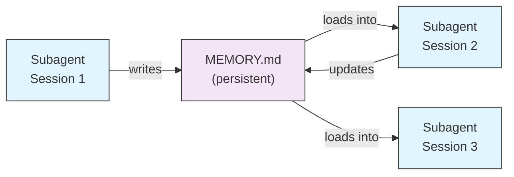
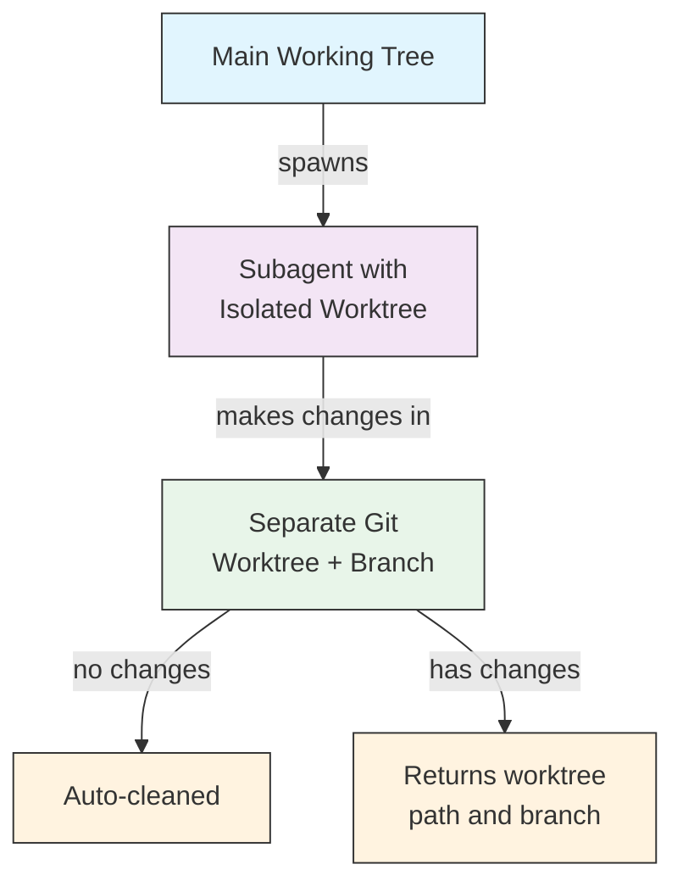
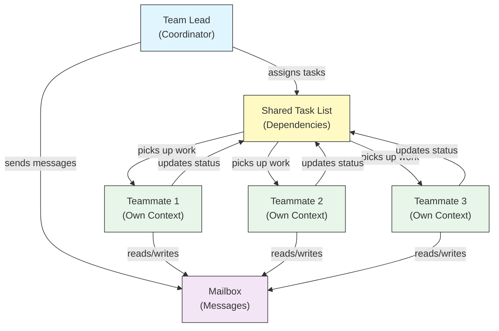
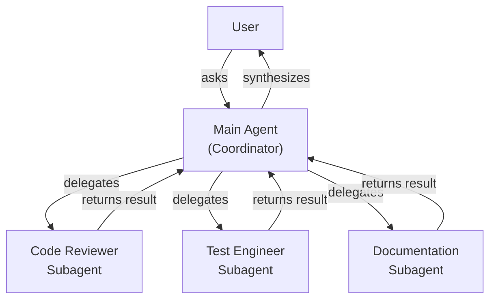
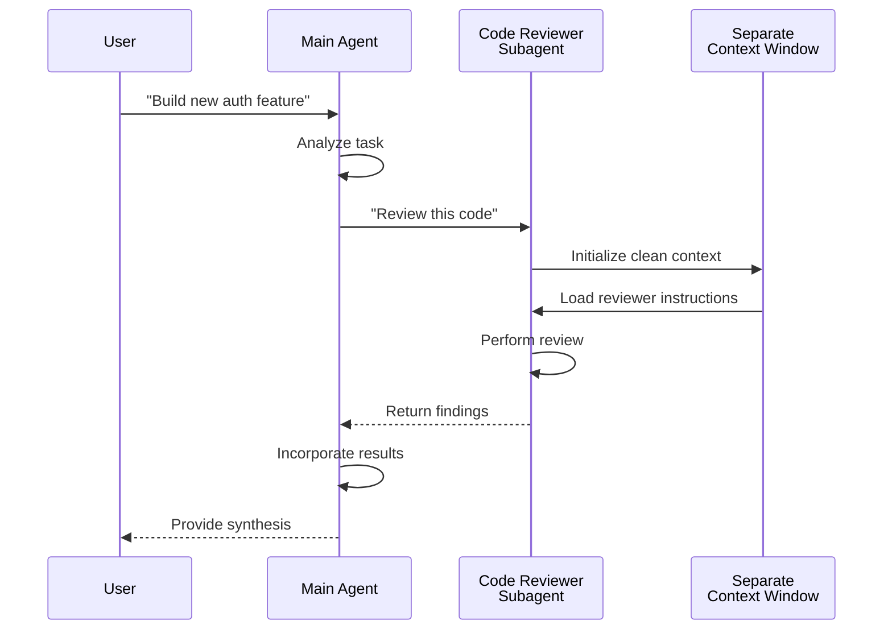
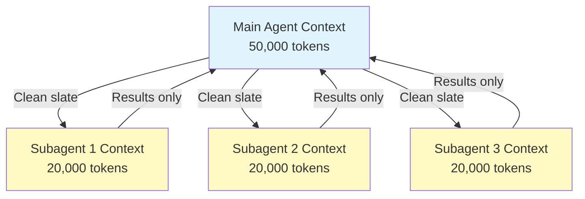
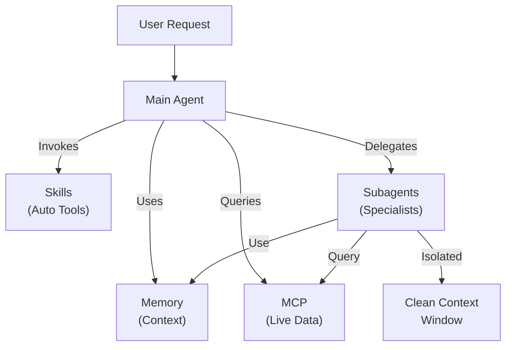

<picture>
  <source media="(prefers-color-scheme: dark)" srcset="../resources/logos/claude-howto-logo-dark.svg">
  
</picture>

# Subagents（子 Agent）- 完整参考指南

Subagents（子 Agent）是 Claude Code 可以将任务委托给的专业化 AI 助手。每个子 Agent 都有特定用途，使用独立于主对话的上下文窗口，可以配置特定工具和自定义系统提示词。

## 目录

1. [概述](#概述)
2. [核心优势](#核心优势)
3. [文件位置](#文件位置)
4. [配置](#配置)
5. [内置子 Agent](#内置子-agent)
6. [管理子 Agent](#管理子-agent)
7. [使用子 Agent](#使用子-agent)
8. [可恢复 Agent](#可恢复-agent)
9. [链式调用子 Agent](#链式调用子-agent)
10. [子 Agent 的持久化内存](#子-agent-的持久化内存)
11. [后台子 Agent](#后台子-agent)
12. [Worktree 隔离](#worktree-隔离)
13. [限制可生成的子 Agent](#限制可生成的子-agent)
14. [`claude agents` CLI 命令](#claude-agents-cli-命令)
15. [Agent 团队（实验性）](#agent-团队实验性)
16. [插件子 Agent 安全](#插件子-agent-安全)
17. [架构](#架构)
18. [上下文管理](#上下文管理)
19. [何时使用子 Agent](#何时使用子-agent)
20. [最佳实践](#最佳实践)
21. [本文件夹中的示例子 Agent](#本文件夹中的示例子-agent)
22. [安装说明](#安装说明)
23. [相关概念](#相关概念)

---

## 概述

子 Agent 通过以下方式实现 Claude Code 中的委托任务执行：

- 创建具有独立上下文窗口的**隔离 AI 助手**
- 提供用于专业领域的**自定义系统提示词**
- 强制实施**工具访问控制**以限制能力
- 防止复杂任务造成的**上下文污染**
- 支持多个专业任务的**并行执行**

每个子 Agent 独立运作，从干净的上下文开始，只接收任务所需的特定上下文，然后将结果返回给主 Agent 进行综合。

**快速开始**：使用 `/agents` 命令交互式创建、查看、编辑和管理子 Agent。

---

## 核心优势

| 优势 | 描述 |
|---------|-------------|
| **保留上下文** | 在独立上下文中运作，防止主对话被污染 |
| **专业特长** | 针对特定领域微调，成功率更高 |
| **可复用性** | 跨不同项目使用，与团队共享 |
| **灵活的权限** | 不同类型的子 Agent 具有不同的工具访问级别 |
| **可扩展性** | 多个 Agent 同时处理不同方面 |

---

## 文件位置

子 Agent 文件可以存储在多个位置，具有不同的作用域：

| 优先级 | 类型 | 位置 | 作用域 |
|----------|------|----------|-------|
| 1（最高）| **CLI 定义的** | 通过 `--agents` 标志（JSON） | 仅当前会话 |
| 2 | **项目子 Agent** | `.claude/agents/` | 当前项目 |
| 3 | **用户子 Agent** | `~/.claude/agents/` | 所有项目 |
| 4（最低）| **插件 Agent** | 插件的 `agents/` 目录 | 通过插件 |

当存在重复名称时，高优先级来源优先。

---

## 配置

### 文件格式

子 Agent 定义在 YAML frontmatter 中，后跟 markdown 格式的系统提示词：

```yaml
---
name: your-sub-agent-name
description: 描述何时应调用此子 Agent
tools: tool1, tool2, tool3  # 可选 - 省略则继承所有工具
disallowedTools: tool4  # 可选 - 明确禁止的工具
model: sonnet  # 可选 - sonnet、opus、haiku 或 inherit
permissionMode: default  # 可选 - 权限模式
maxTurns: 20  # 可选 - 限制 Agent 的回合数
skills: skill1, skill2  # 可选 - 预加载到上下文的技能
mcpServers: server1  # 可选 - 可用的 MCP 服务器
memory: user  # 可选 - 持久化内存作用域（user、project、local）
background: false  # 可选 - 作为后台任务运行
effort: high  # 可选 - 推理努力程度（low、medium、high、max）
isolation: worktree  # 可选 - git worktree 隔离
initialPrompt: "首先分析代码库"  # 可选 - 自动提交的第一个回合
hooks:  # 可选 - 组件范围的钩子
  PreToolUse:
    - matcher: "Bash"
      hooks:
        - type: command
          command: "./scripts/security-check.sh"
---

你的子 Agent 系统提示词在这里。这可以是多个段落，
应明确定义子 Agent 的角色、能力解决问题的方法。
```

### 配置字段

| 字段 | 必填 | 描述 |
|-------|----------|----------|
| `name` | 是 | 唯一标识符（小写字母和连字符） |
| `description` | 是 | 目的的自然语言描述。包含"use PROACTIVELY"以鼓励自动调用 |
| `tools` | 否 | 特定工具的逗号分隔列表。省略则继承所有工具。支持 `Agent(agent_name)` 语法以限制可生成的子 Agent |
| `disallowedTools` | 否 | 子 Agent 不得使用的工具逗号分隔列表 |
| `model` | 否 | 使用的模型：`sonnet`、`opus`、`haiku`、完整模型 ID 或 `inherit`。默认为配置的子 Agent 模型 |
| `permissionMode` | 否 | `default`、`acceptEdits`、`dontAsk`、`bypassPermissions`、`plan` |
| `maxTurns` | 否 | 子 Agent 可以执行的最大 Agent 回合数 |
| `skills` | 否 | 逗号分隔的技能列表。在启动时将完整技能内容注入子 Agent 上下文 |
| `mcpServers` | 否 | 可供子 Agent 使用的 MCP 服务器 |
| `hooks` | 否 | 组件范围的钩子（PreToolUse、PostToolUse、Stop） |
| `memory` | 否 | 持久化内存目录作用域：`user`、`project` 或 `local` |
| `background` | 否 | 设置为 `true` 以始终将此子 Agent 作为后台任务运行 |
| `effort` | 否 | 推理努力级别：`low`、`medium`、`high` 或 `max` |
| `isolation` | 否 | 设置为 `worktree` 以给子 Agent 自己的 git worktree |
| `initialPrompt` | 否 | 当子 Agent 作为主 Agent 运行时自动提交的第一个回合 |

### 工具配置选项

**选项 1：继承所有工具（省略字段）**
```yaml
---
name: full-access-agent
description: 具有所有可用工具的 Agent
---
```

**选项 2：指定单个工具**
```yaml
---
name: limited-agent
description: 仅具有特定工具的 Agent
tools: Read, Grep, Glob, Bash
---
```

**选项 3：条件工具访问**
```yaml
---
name: conditional-agent
description: 具有过滤工具访问的 Agent
tools: Read, Bash(npm:*), Bash(test:*)
---
```

### 基于 CLI 的配置

使用 `--agents` 标志和 JSON 格式为单个会话定义子 Agent：

```bash
claude --agents '{
  "code-reviewer": {
    "description": "专业代码审查员。在代码更改后主动使用。",
    "prompt": "你是一位资深代码审查员。专注于代码质量、安全性和最佳实践。",
    "tools": ["Read", "Grep", "Glob", "Bash"],
    "model": "sonnet"
  }
}'
```

**`--agents` 标志的 JSON 格式：**

```json
{
  "agent-name": {
    "description": "必填：何时调用此 Agent",
    "prompt": "必填：Agent 的系统提示词",
    "tools": ["可选", "工具", "数组"],
    "model": "可选：sonnet|opus|haiku"
  }
}
```

**Agent 定义优先级：**

Agent 定义按以下优先级加载（先匹配优先）：
1. **CLI 定义的** - `--agents` 标志（仅会话，JSON）
2. **项目级** - `.claude/agents/`（当前项目）
3. **用户级** - `~/.claude/agents/`（所有项目）
4. **插件级** - 插件 `agents/` 目录

这允许 CLI 定义在单个会话中覆盖所有其他来源。

---

## 内置子 Agent

Claude Code 包含多个始终可用的内置子 Agent：

| Agent | 模型 | 用途 |
|-------|-------|---------|
| **general-purpose** | 继承 | 复杂的多步骤任务 |
| **Plan** | 继承 | 计划模式研究 |
| **Explore** | Haiku | 只读代码库探索（快速/中等/非常彻底） |
| **Bash** | 继承 | 在独立上下文中的终端命令 |
| **statusline-setup** | Sonnet | 配置状态栏 |
| **Claude Code Guide** | Haiku | 回答 Claude Code 功能问题 |

### General-Purpose 子 Agent

| 属性 | 值 |
|----------|-------|
| **模型** | 继承自父级 |
| **工具** | 所有工具 |
| **用途** | 复杂的研究任务、多步骤操作、代码修改 |

**使用场景**：需要同时探索和修改且推理复杂的任务。

### Plan 子 Agent

| 属性 | 值 |
|----------|-------|
| **模型** | 继承自父级 |
| **工具** | Read、Glob、Grep、Bash |
| **用途** | 在计划模式中自动用于研究代码库 |

**使用场景**：当 Claude 需要在提出计划之前了解代码库时。

### Explore 子 Agent

| 属性 | 值 |
|----------|-------|
| **模型** | Haiku（快速、低延迟） |
| **模式** | 严格只读 |
| **工具** | Glob、Grep、Read、Bash（仅只读命令） |
| **用途** | 快速代码库搜索和分析 |

**使用场景**：在搜索/理解代码而不进行更改时。

**彻底程度级别** - 指定探索深度：
- **"quick"** - 最小探索的快速搜索，适合查找特定模式
- **"medium"** - 中等探索，速度和彻底程度平衡，默认方法
- **"very thorough"** - 跨多个位置和命名约定的全面分析，可能需要更长时间

### Bash 子 Agent

| 属性 | 值 |
|----------|-------|
| **模型** | 继承自父级 |
| **工具** | Bash |
| **用途** | 在独立的上下文窗口中执行终端命令 |

**使用场景**：运行受益于隔离上下文的 shell 命令时。

### Statusline Setup 子 Agent

| 属性 | 值 |
|----------|-------|
| **模型** | Sonnet |
| **工具** | Read、Write、Bash |
| **用途** | 配置 Claude Code 状态栏显示 |

**使用场景**：设置或自定义状态栏时。

### Claude Code Guide 子 Agent

| 属性 | 值 |
|----------|-------|
| **模型** | Haiku（快速、低延迟） |
| **工具** | 只读 |
| **用途** | 回答有关 Claude Code 功能和用法的问题 |

**使用场景**：当用户询问 Claude Code 如何工作或如何使用特定功能时。

---

## 管理子 Agent

### 使用 `/agents` 命令（推荐）

```bash
/agents
```

这提供一个交互式菜单来：
- 查看所有可用的子 Agent（内置、用户和项目）
- 通过引导设置创建新的子 Agent
- 编辑现有自定义子 Agent 和工具访问
- 删除自定义子 Agent
- 查看存在重复时哪些子 Agent 处于活跃状态

### 直接文件管理

```bash
# 创建项目子 Agent
mkdir -p .claude/agents
cat > .claude/agents/test-runner.md << 'EOF'
---
name: test-runner
description: 主动使用以运行测试并修复失败
---

你是一位测试自动化专家。当你看到代码更改时，主动运行适当的测试。
如果测试失败，分析失败原因并在保留原始测试意图的同时修复它们。
EOF

# 创建用户子 Agent（在所有项目中可用）
mkdir -p ~/.claude/agents
```

---

## 使用子 Agent

### 自动委托

Claude 基于以下内容主动委托任务：
- 请求中的任务描述
- 子 Agent 配置中的 `description` 字段
- 当前上下文和可用工具

为鼓励主动使用，在 `description` 字段中包含"use PROACTIVELY"或"MUST BE USED"：

```yaml
---
name: code-reviewer
description: 专业代码审查专家。在编写或修改代码后主动使用。
---
```

### 显式调用

你可以显式请求特定的子 Agent：

```
> 使用 test-runner 子 Agent 修复失败的测试
> 让 code-reviewer 子 Agent 查看我最近的更改
> 让 debugger 子 Agent 调查这个错误
```

### @-提及调用

使用 `@` 前缀保证调用特定子 Agent（绕过自动委托启发式）：

```
> @"code-reviewer (agent)" 审查 auth 模块
```

### 会话级 Agent

使用特定 Agent 作为主 Agent 运行整个会话：

```bash
# 通过 CLI 标志
claude --agent code-reviewer

# 通过 settings.json
{
  "agent": "code-reviewer"
}
```

### 列出可用 Agent

使用 `claude agents` 命令列出所有来源的所有已配置 Agent：

```bash
claude agents
```

---

## 可恢复 Agent

子 Agent 可以继续之前的对话，保留完整上下文：

```bash
# 初始调用
> 使用 code-analyzer agent 开始审查 authentication 模块
# 返回 agentId: "abc123"

# 之后恢复 agent
> 恢复 agent abc123，现在也分析 authorization 逻辑
```

**使用场景**：
- 跨多个会话的长期研究
- 不丢失上下文的迭代改进
- 保持上下文的多步骤工作流

---

## 链式调用子 Agent

按顺序执行多个子 Agent：

```bash
> 首先使用 code-analyzer subagent 查找性能问题，
  然后使用 optimizer subagent 修复它们
```

这支持复杂工作流，其中一个子 Agent 的输出作为另一个的输入。

---

## 子 Agent 的持久化内存

`memory` 字段为子 Agent 提供一个在对话之间持久化的目录。这允许子 Agent 随着时间积累知识，存储笔记、发现和跨会话持续存在的上下文。

### 内存作用域

| 作用域 | 目录 | 使用场景 |
|-------|-----------|---------|
| `user` | `~/.claude/agent-memory/<name>/` | 跨所有项目的个人笔记和偏好 |
| `project` | `.claude/agent-memory/<name>/` | 与团队共享的项目特定知识 |
| `local` | `.claude/agent-memory-local/<name>/` | 不提交到版本控制的本地项目知识 |

### 工作原理

- 内存目录中 `MEMORY.md` 的前 200 行自动加载到子 Agent 的系统提示词中
- `Read`、`Write` 和 `Edit` 工具自动启用，供子 Agent 管理其内存文件
- 子 Agent 可以根据需要在其内存目录中创建额外文件

### 配置示例

```yaml
---
name: researcher
memory: user
---

你是一位研究助理。使用你的内存目录存储发现、
跨会话跟踪进度并随时间积累知识。

在每个会话开始时检查你的 MEMORY.md 文件以回忆之前的上下文。
```



---

## 后台子 Agent

子 Agent 可以在后台运行，释放主对话进行其他任务。

### 配置

在 frontmatter 中设置 `background: true` 以始终将子 Agent 作为后台任务运行：

```yaml
---
name: long-runner
background: true
description: 在后台执行长时间运行的分析任务
---
```

### 键盘快捷键

| 快捷键 | 操作 |
|----------|--------|
| `Ctrl+B` | 将当前运行的子 Agent 任务置于后台 |
| `Ctrl+F` | 终止所有后台 Agent（按两次确认） |

### 禁用后台任务

设置环境变量完全禁用后台任务支持：

```bash
export CLAUDE_CODE_DISABLE_BACKGROUND_TASKS=1
```

---

## Worktree 隔离

`isolation: worktree` 设置为子 Agent 提供自己的 git worktree，允许它独立进行更改而不影响主工作树。

### 配置

```yaml
---
name: feature-builder
isolation: worktree
description: 在隔离的 git worktree 中实现功能
tools: Read, Write, Edit, Bash, Grep, Glob
---
```

### 工作原理



- 子 Agent 在独立分支上的自己的 git worktree 中运作
- 如果子 Agent 没有进行更改，worktree 会自动清理
- 如果存在更改，worktree 路径和分支名称会返回给主 Agent 进行审查或合并

---

## 限制可生成的子 Agent

你可以通过在 `tools` 字段中使用 `Agent(agent_type)` 语法来控制给定子 Agent 允许生成哪些子 Agent。这提供了一种白名单特定子 Agent 进行委托的方法。

> **注意**：在 v2.1.63 中，`Task` 工具被重命名为 `Agent`。现有的 `Task(...)` 引用仍然作为别名工作。

### 示例

```yaml
---
name: coordinator
description: 协调专门 Agent 之间的工作
tools: Agent(worker, researcher), Read, Bash
---

你是一个协调者 Agent。你只能委托工作给 "worker" 和
"researcher" 子 Agent。使用 Read 和 Bash 进行你自己的探索。
```

在这个例子中，`coordinator` 子 Agent 只能生成 `worker` 和 `researcher` 子 Agent。它不能生成任何其他子 Agent，即使它们在其他地方定义。

---

## `claude agents` CLI 命令

`claude agents` 命令列出按来源分组的所有已配置 Agent（内置、用户级、项目级）：

```bash
claude agents
```

此命令：
- 显示所有来源的所有可用 Agent
- 按来源位置对 Agent 进行分组
- 指示**覆盖**：当较高优先级级别的 Agent 遮蔽较低优先级级别的 Agent 时的覆盖（例如，与用户级 Agent 同名的项目级 Agent）

---

## Agent 团队（实验性）

Agent 团队协调多个 Claude Code 实例共同处理复杂任务。与子 Agent（委托返回结果的子任务）不同，队友独立运作，拥有自己的上下文，通过共享邮箱系统直接通信。

> **注意**：Agent 团队是实验性功能，需要 Claude Code v2.1.32+。使用前请先启用。

### 子 Agent 与 Agent 团队对比

| 方面 | 子 Agent | Agent 团队 |
|--------|-----------|-------------|
| **委托模型** | 父级委托子任务，等待结果 | 团队领导分配工作，队友独立执行 |
| **上下文** | 每个子任务全新上下文，结果提炼回来 | 每个队友维护自己的持久上下文 |
| **协调** | 顺序或并行，由父级管理 | 带自动依赖管理的共享任务列表 |
| **通信** | 仅返回值 | 通过邮箱进行 Agent 间消息传递 |
| **会话恢复** | 支持 | 不支持进程内队友 |
| **最佳场景** | 专注、定义明确的子任务 | 需要并行工作的大型多文件项目 |

### 启用 Agent 团队

设置环境变量或添加到 `settings.json`：

```bash
export CLAUDE_CODE_EXPERIMENTAL_AGENT_TEAMS=1
```

或在 `settings.json` 中：

```json
{
  "env": {
    "CLAUDE_CODE_EXPERIMENTAL_AGENT_TEAMS": "1"
  }
}
```

### 启动团队

启用后，在提示词中要求 Claude 与队友协作：

```
用户：构建 authentication 模块。使用团队——一个队友负责 API 端点，
      一个负责数据库 schema，一个负责测试套件。
```

Claude 将创建团队、分配任务并自动协调工作。

### 显示模式

控制队友活动的显示方式：

| 模式 | 标志 | 描述 |
|------|------|-------|
| **自动** | `--teammate-mode auto` | 自动为你的终端选择最佳显示模式 |
| **进程内** | `--teammate-mode in-process` | 在当前终端内联显示队友输出（默认） |
| **分屏** | `--teammate-mode tmux` | 在单独的 tmux 或 iTerm2 窗格中打开每个队友 |

```bash
claude --teammate-mode tmux
```

你也可以在 `settings.json` 中设置显示模式：

```json
{
  "teammateMode": "tmux"
}
```

> **注意**：分屏模式需要 tmux 或 iTerm2。在 VS Code 终端、Windows Terminal 或 Ghostty 中不可用。

### 导航

在分屏模式下使用 `Shift+Down` 在队友之间导航。

### 团队配置

团队配置存储在 `~/.claude/teams/{team-name}/config.json`。

### 架构



**关键组件**：

- **团队领导**：创建团队、分配任务并协调的主 Claude Code 会话
- **共享任务列表**：带自动依赖跟踪的同步任务列表
- **邮箱**：队友用于通信状态和协调的 Agent 间消息系统
- **队友**：独立的 Claude Code 实例，每个都有自己的上下文窗口

### 任务分配和消息传递

团队领导将工作分解为任务并分配给队友。共享任务列表处理：

- **自动依赖管理** — 任务等待其依赖完成
- **状态跟踪** — 队友在工作时更新任务状态
- **Agent 间消息传递** — 队友通过邮箱发送消息进行协调（例如，"数据库 schema 已就绪，你可以开始编写查询"）

### 计划审批工作流

对于复杂任务，团队领导在队友开始工作之前创建执行计划。用户审查并批准计划，确保团队的方法在做出任何代码更改之前符合预期。

### 团队的钩子事件

Agent 团队引入了两个额外的[钩子事件](../06-hooks/)：

| 事件 | 触发时机 | 使用场景 |
|-------|-----------|---------|
| `TeammateIdle` | 队友完成当前任务且没有待处理工作时 | 触发通知、分配后续任务 |
| `TaskCompleted` | 共享任务列表中的任务标记为完成时 | 运行验证、更新仪表板、链接依赖工作 |

### 最佳实践

- **团队规模**：保持 3-5 个队友以获得最佳协调
- **任务大小**：将工作分解为每个耗时 5-15 分钟的任务——小到可以并行化，大到有意义
- **避免文件冲突**：将不同文件或目录分配给不同队友以防止合并冲突
- **从简单开始**：首次使用进程内模式；熟悉后再切换到分屏
- **清晰的任务描述**：提供具体、可操作的任务描述，以便队友独立工作

### 限制

- **实验性**：功能行为可能在未来版本中更改
- **无会话恢复**：进程内队友在会话结束后无法恢复
- **每个会话一个团队**：无法在单个会话中创建嵌套团队或多个团队
- **固定领导**：团队领导角色不能转移给队友
- **分屏限制**：需要 tmux/iTerm2；VS Code 终端、Windows Terminal 或 Ghostty 不可用
- **无跨会话团队**：队友仅在当前会话中存在

> **警告**：Agent 团队是实验性功能。先用非关键工作进行测试，并监控队友协调以发现意外行为。

---

## 插件子 Agent 安全

插件提供的子 Agent 在安全方面受到限制的 frontmatter 功能。以下字段在插件子 Agent 定义中**不允许**：

- `hooks` - 不能定义生命周期钩子
- `mcpServers` - 不能配置 MCP 服务器
- `permissionMode` - 不能覆盖权限设置

这防止插件通过子 Agent 钩子提升权限或执行任意命令。

---

## 架构

### 高层架构



### 子 Agent 生命周期



---

## 上下文管理



### 关键点

- 每个子 Agent 都获得一个**全新的上下文窗口**，不包含主对话历史
- 只有**相关上下文**传递给子 Agent 执行其特定任务
- 结果**提炼**返回给主 Agent
- 这防止长时间项目中的**上下文 Token 耗尽**

### 性能考虑

- **上下文效率** - Agent 保留主上下文，支持更长的会话
- **延迟** - 子 Agent 从干净的上下文开始，收集初始上下文可能会增加延迟

### 关键行为

- **无嵌套生成** - 子 Agent 不能生成其他子 Agent
- **后台权限** - 后台子 Agent 自动拒绝任何未预先批准权限
- **后台化** - 按 `Ctrl+B` 将当前运行的任务置于后台
- **转录** - 子 Agent 转录存储在 `~/.claude/projects/{project}/{sessionId}/subagents/agent-{agentId}.jsonl`
- **自动压缩** - 子 Agent 上下文在约 95% 容量时自动压缩（使用 `CLAUDE_AUTOCOMPACT_PCT_OVERRIDE` 环境变量覆盖）

---

## 何时使用子 Agent

| 场景 | 使用子 Agent | 原因 |
|----------|--------------|-----|
| 有很多步骤的复杂功能 | 是 | 分离关注点，防止上下文污染 |
| 快速代码审查 | 否 | 不必要的开销 |
| 并行任务执行 | 是 | 每个子 Agent 有自己的上下文 |
| 需要专业特长 | 是 | 自定义系统提示词 |
| 长时间运行的分析 | 是 | 防止主上下文耗尽 |
| 单个任务 | 否 | 不必要地增加延迟 |

---

## 最佳实践

### 设计原则

**应该**：
- 从 Claude 生成的 Agent 开始 - 用 Claude 生成初始子 Agent，然后迭代定制
- 设计专注的子 Agent - 单一、清晰的职责而非一个大包罗万象
- 编写详细提示词 - 包含具体说明、示例和约束
- 限制工具访问 - 只授予子 Agent 目的所需的必要工具
- 版本控制 - 将项目子 Agent 提交到版本控制以便团队协作

**不应该**：
- 创建角色相同的重叠子 Agent
- 给子 Agent 不必要的工具访问权限
- 为简单的单步任务使用子 Agent
- 在一个子 Agent 的提示词中混合关注点
- 忘记传递必要的上下文

### 系统提示词最佳实践

1. **具体说明角色**
   ```
   你是一位专注于[特定领域]的专家代码审查员
   ```

2. **明确定义优先级**
   ```
   审查优先级（按顺序）：
   1. 安全问题
   2. 性能问题
   3. 代码质量
   ```

3. **指定输出格式**
   ```
   每个问题提供：严重程度、类别、位置、描述、修复、影响
   ```

4. **包含操作步骤**
   ```
   当被调用时：
   1. 运行 git diff 查看最近的更改
   2. 重点关注修改的文件
   3. 立即开始审查
   ```

### 工具访问策略

1. **从限制开始**：仅从基本工具开始
2. **仅在需要时扩展**：根据需求添加工具
3. **尽可能只读**：对分析 Agent 使用 Read/Grep
4. **沙箱执行**：将 Bash 命令限制为特定模式

---

## 本文件夹中的示例子 Agent

本文件夹包含可直接使用的示例子 Agent：

### 1. 代码审查 Agent（`code-reviewer.md`）

**用途**：全面的代码质量和可维护性分析

**工具**：Read、Grep、Glob、Bash

**专业领域**：
- 安全漏洞检测
- 性能优化识别
- 代码可维护性评估
- 测试覆盖率分析

**使用场景**：需要专注于质量和安全性的自动化代码审查时

---

### 2. 测试工程师（`test-engineer.md`）

**用途**：测试策略、覆盖率分析和自动化测试

**工具**：Read、Write、Bash、Grep

**专业领域**：
- 单元测试创建
- 集成测试设计
- 边界情况识别
- 覆盖率分析（目标 80% 以上）

**使用场景**：需要全面测试套件创建或覆盖率分析时

---

### 3. 文档编写 Agent（`documentation-writer.md`）

**用途**：技术文档、API 文档和用户指南

**工具**：Read、Write、Grep

**专业领域**：
- API 端点文档
- 用户指南创建
- 架构文档
- 代码注释改进

**使用场景**：需要创建或更新项目文档时

---

### 4. 安全审查 Agent（`secure-reviewer.md`）

**用途**：具有最小权限的安全重点代码审查

**工具**：Read、Grep

**专业领域**：
- 安全漏洞检测
- 身份验证/授权问题
- 数据泄露风险
- 注入攻击识别

**使用场景**：需要安全审计但无修改能力时

---

### 5. 实现 Agent（`implementation-agent.md`）

**用途**：功能开发的完整实现能力

**工具**：Read、Write、Edit、Bash、Grep、Glob

**专业领域**：
- 功能实现
- 代码生成
- 构建和测试执行
- 代码库修改

**使用场景**：需要子 Agent 端到端实现功能时

---

### 6. 调试 Agent（`debugger.md`）

**用途**：处理错误、测试失败和意外行为的调试专家

**工具**：Read、Edit、Bash、Grep、Glob

**专业领域**：
- 根本原因分析
- 错误调查
- 测试失败解决
- 最小修复实现

**使用场景**：遇到 bug、错误或意外行为时

---

### 7. 数据科学家（`data-scientist.md`）

**用途**：SQL 查询和数据洞察的数据分析专家

**工具**：Bash、Read、Write

**专业领域**：
- SQL 查询优化
- BigQuery 操作
- 数据分析和可视化
- 统计洞察

**使用场景**：需要进行数据分析、SQL 查询或 BigQuery 操作时

---

## 安装说明

### 方法 1：使用 /agents 命令（推荐）

```bash
/agents
```

然后：
1. 选择"创建新 Agent"
2. 选择项目级或用户级
3. 详细描述你的子 Agent
4. 选择授予访问权限的工具（或留空继承全部）
5. 保存并使用

### 方法 2：复制到项目

将 agent 文件复制到项目的 `.claude/agents/` 目录：

```bash
# 导航到你的项目
cd /path/to/your/project

# 如果 agents 目录不存在则创建
mkdir -p .claude/agents

# 从本文件夹复制所有 agent 文件
cp /path/to/04-subagents/*.md .claude/agents/

# 移除 README（.claude/agents 中不需要）
rm .claude/agents/README.md
```

### 方法 3：复制到用户目录

对于在你所有项目中都可用的 agent：

```bash
# 创建用户 agents 目录
mkdir -p ~/.claude/agents

# 复制 agents
cp /path/to/04-subagents/code-reviewer.md ~/.claude/agents/
cp /path/to/04-subagents/debugger.md ~/.claude/agents/
# ... 根据需要复制其他
```

### 验证

安装后，验证 agent 被识别：

```bash
/agents
```

你应该看到你安装的 agent 与内置 agent 一起列出。

---

## 文件结构

```
project/
├── .claude/
│   └── agents/
│       ├── code-reviewer.md
│       ├── test-engineer.md
│       ├── documentation-writer.md
│       ├── secure-reviewer.md
│       ├── implementation-agent.md
│       ├── debugger.md
│       └── data-scientist.md
└── ...
```

---

## 相关概念

### 相关功能

- **[斜杠命令](../01-slash-commands/)** - 用户快速调用的快捷方式
- **[记忆](../02-memory/)** - 跨会话持久化上下文
- **[技能](../03-skills/)** - 可复用的自主能力
- **[MCP 协议](../05-mcp/)** - 实时外部数据访问
- **[钩子](../06-hooks/)** - 事件驱动的 shell 命令自动化
- **[插件](../07-plugins/)** - 捆绑的扩展包

### 与其他功能对比

| 功能 | 用户调用 | 自动调用 | 持久化 | 外部访问 | 隔离上下文 |
|---------|--------------|--------------|-----------|------------------|------------------|
| **斜杠命令** | 是 | 否 | 否 | 否 | 否 |
| **子 Agent** | 是 | 是 | 否 | 否 | 是 |
| **记忆** | 自动 | 自动 | 是 | 否 | 否 |
| **MCP** | 自动 | 是 | 否 | 是 | 否 |
| **技能** | 是 | 是 | 否 | 否 | 否 |

### 集成模式



---

## 其他资源

- [官方子 Agent 文档](https://code.claude.com/docs/en/sub-agents)
- [CLI 参考](https://code.claude.com/docs/en/cli-reference) - `--agents` 标志和其他 CLI 选项
- [插件指南](../07-plugins/) - 用于捆绑 Agent 与其他功能
- [技能指南](../03-skills/) - 用于自动调用能力
- [记忆指南](../02-memory/) - 用于持久化上下文
- [钩子指南](../06-hooks/) - 用于事件驱动自动化

---

*最后更新：2026 年 3 月*

*本指南涵盖 Claude Code 的完整子 Agent 配置、委托模式和最佳实践。*
