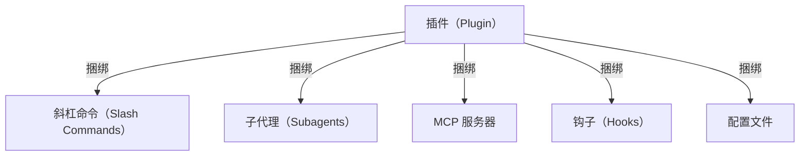
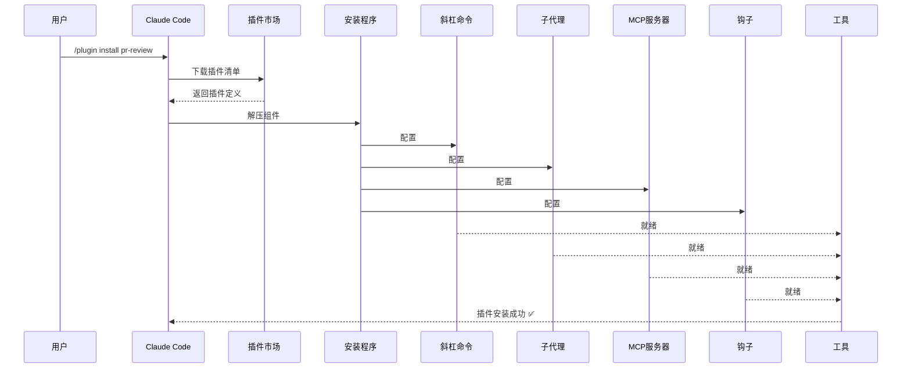
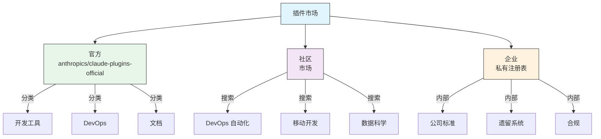
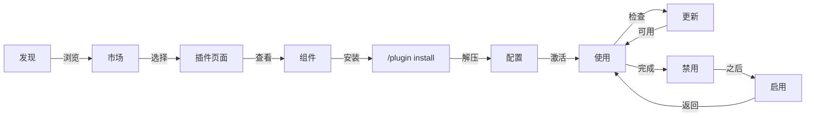
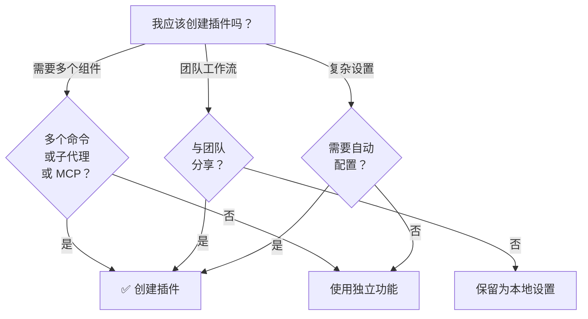

<picture>
  <source media="(prefers-color-scheme: dark)" srcset="../resources/logos/claude-howto-logo-dark.svg">
  
</picture>

# Claude Code 插件（Plugins）

本目录包含将多个 Claude Code 功能捆绑为可安装包的完整插件示例。

## 概述

Claude Code 插件是将各种自定义功能（斜杠命令、子代理、MCP 服务器和钩子）捆绑在一起的集合，通过一条命令即可完成安装。它们代表了最高级别的扩展机制——将多个功能整合为内聚的、可分享的包。

## 插件架构



## 插件加载流程



## 插件类型与分发

| 类型 | 范围 | 共享对象 | 权威来源 | 示例 |
|------|------|----------|----------|------|
| 官方 | 全局 | 所有用户 | Anthropic | PR 审查、安全指南 |
| 社区 | 公开 | 所有用户 | 社区 | DevOps、数据科学 |
| 组织 | 内部 | 团队成员 | 公司 | 内部标准、工具 |
| 个人 | 个人 | 单个用户 | 开发者 | 自定义工作流 |

## 插件定义结构

插件清单使用 JSON 格式，位于 `.claude-plugin/plugin.json`：

```json
{
  "name": "my-first-plugin",
  "description": "一个问候插件",
  "version": "1.0.0",
  "author": {
    "name": "你的名字"
  },
  "homepage": "https://example.com",
  "repository": "https://github.com/user/repo",
  "license": "MIT"
}
```

## 插件结构示例

```
my-plugin/
├── .claude-plugin/
│   └── plugin.json       # 清单文件（名称、描述、版本、作者）
├── commands/             # Markdown 格式的斜杠命令
│   ├── task-1.md
│   ├── task-2.md
│   └── workflows/
├── agents/               # 自定义代理定义
│   ├── specialist-1.md
│   ├── specialist-2.md
│   └── configs/
├── skills/               # 包含 SKILL.md 的代理技能
│   ├── skill-1.md
│   └── skill-2.md
├── hooks/                # hooks.json 中的事件处理器
│   └── hooks.json
├── .mcp.json             # MCP 服务器配置
├── .lsp.json             # LSP 服务器配置
├── settings.json         # 默认设置
├── templates/
│   └── issue-template.md
├── scripts/
│   ├── helper-1.sh
│   └── helper-2.py
├── docs/
│   ├── README.md
│   └── USAGE.md
└── tests/
    └── plugin.test.js
```

### LSP 服务器配置

插件可以包含语言服务器协议（LSP）支持，以提供实时代码智能。LSP 服务器在工作时会提供诊断、代码导航和符号信息。

**配置位置**：
- 插件根目录下的 `.lsp.json` 文件
- `plugin.json` 中的内联 `lsp` 键

#### 字段参考

| 字段 | 必填 | 描述 |
|------|------|------|
| `command` | 是 | LSP 服务器二进制文件（必须在 PATH 中） |
| `extensionToLanguage` | 是 | 将文件扩展名映射到语言 ID |
| `args` | 否 | 服务器的命令行参数 |
| `transport` | 否 | 通信方式：`stdio`（默认）或 `socket` |
| `env` | 否 | 服务器进程的环境变量 |
| `initializationOptions` | 否 | LSP 初始化期间发送的选项 |
| `settings` | 否 | 传递给服务器的工作区配置 |
| `workspaceFolder` | 否 | 覆盖工作区文件夹路径 |
| `startupTimeout` | 否 | 等待服务器启动的最大时间（毫秒） |
| `shutdownTimeout` | 否 | 优雅关闭的最大时间（毫秒） |
| `restartOnCrash` | 否 | 服务器崩溃时自动重启 |
| `maxRestarts` | 否 | 放弃前的最大重启次数 |

#### 配置示例

**Go（gopls）**：

```json
{
  "go": {
    "command": "gopls",
    "args": ["serve"],
    "extensionToLanguage": {
      ".go": "go"
    }
  }
}
```

**Python（pyright）**：

```json
{
  "python": {
    "command": "pyright-langserver",
    "args": ["--stdio"],
    "extensionToLanguage": {
      ".py": "python",
      ".pyi": "python"
    }
  }
}
```

**TypeScript**：

```json
{
  "typescript": {
    "command": "typescript-language-server",
    "args": ["--stdio"],
    "extensionToLanguage": {
      ".ts": "typescript",
      ".tsx": "typescriptreact",
      ".js": "javascript",
      ".jsx": "javascriptreact"
    }
  }
}
```

#### 可用的 LSP 插件

官方市场包含预配置的 LSP 插件：

| 插件 | 语言 | 服务器二进制 | 安装命令 |
|------|------|-------------|----------|
| `pyright-lsp` | Python | `pyright-langserver` | `pip install pyright` |
| `typescript-lsp` | TypeScript/JavaScript | `typescript-language-server` | `npm install -g typescript-language-server typescript` |
| `rust-lsp` | Rust | `rust-analyzer` | 通过 `rustup component add rust-analyzer` 安装 |

#### LSP 功能

配置后，LSP 服务器提供：

- **即时诊断** — 编辑后立即显示错误和警告
- **代码导航** — 转到定义、查找引用、实现
- **悬停信息** — 悬停时显示类型签名和文档
- **符号列表** — 浏览当前文件或工作区中的符号

## 插件选项（v2.1.83+）

插件可以通过清单中的 `userConfig` 声明用户可配置的选项。标记为 `sensitive: true` 的值存储在系统密钥链中，而非明文配置文件：

```json
{
  "name": "my-plugin",
  "version": "1.0.0",
  "userConfig": {
    "apiKey": {
      "description": "服务的 API 密钥",
      "sensitive": true
    },
    "region": {
      "description": "部署区域",
      "default": "us-east-1"
    }
  }
}
```

## 插件持久化数据（`${CLAUDE_PLUGIN_DATA}`）（v2.1.78+）

插件通过 `${CLAUDE_PLUGIN_DATA}` 环境变量访问持久化状态目录。该目录每个插件独有，跨会话持久化，适合用于缓存、数据库和其他持久化状态：

```json
{
  "hooks": {
    "PostToolUse": [
      {
        "command": "node ${CLAUDE_PLUGIN_DATA}/track-usage.js"
      }
    ]
  }
}
```

目录在插件安装时自动创建。存储在其中的文件在插件卸载前保持持久化。

## 通过设置文件内联插件（`source: 'settings'`）（v2.1.80+）

插件可以使用 `source: 'settings'` 字段在设置文件中作为市场条目内联定义。这允许直接嵌入插件定义，无需单独的仓库或市场：

```json
{
  "pluginMarketplaces": [
    {
      "name": "inline-tools",
      "source": "settings",
      "plugins": [
        {
          "name": "quick-lint",
          "source": "./local-plugins/quick-lint"
        }
      ]
    }
  ]
}
```

## 插件设置

插件可以附带 `settings.json` 文件来提供默认配置。当前支持 `agent` 键，用于设置插件的主线程代理：

```json
{
  "agent": "agents/specialist-1.md"
}
```

当插件包含 `settings.json` 时，其默认值在安装时应用。用户可以在自己的项目或用户配置中覆盖这些设置。

## 独立方式 vs 插件方式

| 方式 | 命令名称 | 配置方式 | 适用场景 |
|------|----------|----------|----------|
| **独立** | `/hello` | 在 CLAUDE.md 中手动设置 | 个人、项目特定 |
| **插件** | `/plugin-name:hello` | 通过 plugin.json 自动配置 | 分享、分发、团队使用 |

对于快速个人工作流使用**独立斜杠命令**。当你需要捆绑多个功能、与团队分享或发布分发时使用**插件**。

## 实践示例

### 示例 1：PR 审查插件

**文件：** `.claude-plugin/plugin.json`

```json
{
  "name": "pr-review",
  "version": "1.0.0",
  "description": "包含安全、测试和文档的完整 PR 审查工作流",
  "author": {
    "name": "Anthropic"
  },
  "repository": "https://github.com/anthropic/pr-review",
  "license": "MIT"
}
```

**文件：** `commands/review-pr.md`

```markdown
---
name: Review PR
description: 开始包含安全和测试检查的全面 PR 审查
---

# PR 审查

此命令启动完整的 pull request 审查，包括：

1. 安全分析
2. 测试覆盖率验证
3. 文档更新
4. 代码质量检查
5. 性能影响评估
```

**文件：** `agents/security-reviewer.md`

```yaml
---
name: security-reviewer
description: 专注安全的代码审查
tools: read, grep, diff
---

# 安全审查员

专注于发现安全漏洞：
- 认证/授权问题
- 数据泄露
- 注入攻击
- 安全配置
```

**安装：**

```bash
/plugin install pr-review

# 结果：
# ✅ 3 个斜杠命令已安装
# ✅ 3 个子代理已配置
# ✅ 2 个 MCP 服务器已连接
# ✅ 4 个钩子已注册
# ✅ 准备就绪！
```

### 示例 2：DevOps 插件

**组件：**

```
devops-automation/
├── commands/
│   ├── deploy.md
│   ├── rollback.md
│   ├── status.md
│   └── incident.md
├── agents/
│   ├── deployment-specialist.md
│   ├── incident-commander.md
│   └── alert-analyzer.md
├── mcp/
│   ├── github-config.json
│   ├── kubernetes-config.json
│   └── prometheus-config.json
├── hooks/
│   ├── pre-deploy.js
│   ├── post-deploy.js
│   └── on-error.js
└── scripts/
    ├── deploy.sh
    ├── rollback.sh
    └── health-check.sh
```

### 示例 3：文档插件

**捆绑的组件：**

```
documentation/
├── commands/
│   ├── generate-api-docs.md
│   ├── generate-readme.md
│   ├── sync-docs.md
│   └── validate-docs.md
├── agents/
│   ├── api-documenter.md
│   ├── code-commentator.md
│   └── example-generator.md
├── mcp/
│   ├── github-docs-config.json
│   └── slack-announce-config.json
└── templates/
    ├── api-endpoint.md
    ├── function-docs.md
    └── adr-template.md
```

## 插件市场

由 Anthropic 管理的官方插件目录是 `anthropics/claude-plugins-official`。企业管理员也可以为内部分发创建私有插件市场。



### 市场配置

企业和高级用户可以通过设置控制市场行为：

| 设置 | 描述 |
|------|------|
| `extraKnownMarketplaces` | 在默认来源之外添加额外的市场来源 |
| `strictKnownMarketplaces` | 控制允许用户添加哪些市场 |
| `deniedPlugins` | 管理员管理的阻止列表，防止安装特定插件 |

### 其他市场功能

- **默认 git 超时**：大型插件仓库的超时从 30 秒增加到 120 秒
- **自定义 npm 注册表**：插件可以指定自定义 npm 注册表 URL 用于依赖解析
- **版本锁定**：将插件锁定到特定版本以获得可重现的环境

### 市场定义架构

插件市场在 `.claude-plugin/marketplace.json` 中定义：

```json
{
  "name": "my-team-plugins",
  "owner": "my-org",
  "plugins": [
    {
      "name": "code-standards",
      "source": "./plugins/code-standards",
      "description": "强制执行团队代码标准",
      "version": "1.2.0",
      "author": "platform-team"
    },
    {
      "name": "deploy-helper",
      "source": {
        "source": "github",
        "repo": "my-org/deploy-helper",
        "ref": "v2.0.0"
      },
      "description": "部署自动化工作流"
    }
  ]
}
```

| 字段 | 必填 | 描述 |
|------|------|------|
| `name` | 是 | kebab-case 格式的市场名称 |
| `owner` | 是 | 维护市场的组织或个人 |
| `plugins` | 是 | 插件条目数组 |
| `plugins[].name` | 是 | 插件名称（kebab-case） |
| `plugins[].source` | 是 | 插件来源（路径字符串或来源对象） |
| `plugins[].description` | 否 | 简要插件描述 |
| `plugins[].version` | 否 | 语义化版本字符串 |
| `plugins[].author` | 否 | 插件作者名称 |

### 插件来源类型

插件可以从多个位置获取：

| 来源 | 语法 | 示例 |
|------|------|------|
| **相对路径** | 字符串路径 | `"./plugins/my-plugin"` |
| **GitHub** | `{ "source": "github", "repo": "owner/repo" }` | `{ "source": "github", "repo": "acme/lint-plugin", "ref": "v1.0" }` |
| **Git URL** | `{ "source": "url", "url": "..." }` | `{ "source": "url", "url": "https://git.internal/plugin.git" }` |
| **Git 子目录** | `{ "source": "git-subdir", "url": "...", "path": "..." }` | `{ "source": "git-subdir", "url": "https://github.com/org/monorepo.git", "path": "packages/plugin" }` |
| **npm** | `{ "source": "npm", "package": "..." }` | `{ "source": "npm", "package": "@acme/claude-plugin", "version": "^2.0" }` |
| **pip** | `{ "source": "pip", "package": "..." }` | `{ "source": "pip", "package": "claude-data-plugin", "version": ">=1.0" }` |

GitHub 和 git 来源支持可选的 `ref`（分支/标签）和 `sha`（提交哈希）字段用于版本锁定。

### 分发方式

**GitHub（推荐）**：
```bash
# 用户添加你的市场
/plugin marketplace add owner/repo-name
```

**其他 git 服务**（需要完整 URL）：
```bash
/plugin marketplace add https://gitlab.com/org/marketplace-repo.git
```

**私有仓库**：通过 git 凭证助手或环境令牌支持。用户必须对仓库有读权限。

**官方市场提交**：向 Anthropic 策划的市场提交插件以获得更广泛的分发。

### 严格模式

控制市场定义与本地 `plugin.json` 文件的交互方式：

| 设置 | 行为 |
|------|------|
| `strict: true`（默认） | 本地 `plugin.json` 是权威的；市场条目作为补充 |
| `strict: false` | 市场条目是完整的插件定义 |

**组织限制**与 `strictKnownMarketplaces`：

| 值 | 效果 |
|------|------|
| 未设置 | 无限制 — 用户可以添加任何市场 |
| 空数组 `[]` | 锁定 — 不允许任何市场 |
| 模式数组 | 白名单 — 只有匹配的市场可以被添加 |

```json
{
  "strictKnownMarketplaces": [
    "my-org/*",
    "github.com/trusted-vendor/*"
  ]
}
```

> **警告**：在严格模式下使用 `strictKnownMarketplaces`，用户只能从白名单市场安装插件。这适用于需要受控插件分发的企业环境。

## 插件安装与生命周期



## 插件功能对比

| 功能 | 斜杠命令 | 技能 | 子代理 | 插件 |
|------|----------|------|--------|------|
| **安装** | 手动复制 | 手动复制 | 手动配置 | 一条命令 |
| **设置时间** | 5 分钟 | 10 分钟 | 15 分钟 | 2 分钟 |
| **捆绑** | 单文件 | 单文件 | 单文件 | 多文件 |
| **版本控制** | 手动 | 手动 | 手动 | 自动 |
| **团队分享** | 复制文件 | 复制文件 | 复制文件 | 安装 ID |
| **更新** | 手动 | 手动 | 手动 | 自动可用 |
| **依赖** | 无 | 无 | 无 | 可能有 |
| **市场** | 否 | 否 | 否 | 是 |
| **分发** | 仓库 | 仓库 | 仓库 | 市场 |

## 插件 CLI 命令

所有插件操作都可以作为 CLI 命令使用：

```bash
claude plugin install <name>@<marketplace>   # 从市场安装
claude plugin uninstall <name>               # 移除插件
claude plugin list                           # 列出已安装插件
claude plugin enable <name>                  # 启用已禁用的插件
claude plugin disable <name>                 # 禁用插件
claude plugin validate                       # 验证插件结构
```

## 安装方式

### 从市场安装
```bash
/plugin install plugin-name
# 或从 CLI：
claude plugin install plugin-name@marketplace-name
```

### 启用 / 禁用（自动检测范围）
```bash
/plugin enable plugin-name
/plugin disable plugin-name
```

### 本地插件（用于开发）
```bash
# 用于本地测试的 CLI 标志（可重复用于多个插件）
claude --plugin-dir ./path/to/plugin
claude --plugin-dir ./plugin-a --plugin-dir ./plugin-b
```

### 从 Git 仓库安装
```bash
/plugin install github:username/repo
```

## 何时创建插件



### 插件用例

| 用例 | 建议 | 原因 |
|------|------|------|
| **团队入职** | ✅ 使用插件 | 即时设置，所有配置就绪 |
| **框架设置** | ✅ 使用插件 | 捆绑框架特定的命令 |
| **企业标准** | ✅ 使用插件 | 集中分发，版本控制 |
| **快速任务自动化** | ❌ 使用命令 | 过于复杂 |
| **单一领域专业知识** | ❌ 使用技能 | 太重，使用技能代替 |
| **专业分析** | ❌ 使用子代理 | 手动创建或使用技能 |
| **实时数据访问** | ❌ 使用 MCP | 独立存在，不要捆绑 |

## 测试插件

在发布前，使用 `--plugin-dir` CLI 标志在本地测试插件（可重复用于多个插件）：

```bash
claude --plugin-dir ./my-plugin
claude --plugin-dir ./my-plugin --plugin-dir ./another-plugin
```

这会启动带有加载插件的 Claude Code，允许你：

- 验证所有斜杠命令可用
- 测试子代理和代理功能正常
- 确认 MCP 服务器连接正常
- 验证钩子执行
- 检查 LSP 服务器配置
- 检查任何配置错误

## 热重载

插件在开发过程中支持热重载。修改插件文件时，Claude Code 可以自动检测更改。也可以强制重载：

```bash
/reload-plugins
```

这会重新读取所有插件清单、命令、代理、技能、钩子和 MCP/LSP 配置，无需重启会话。

## 插件托管设置

管理员可以通过托管设置控制组织范围内的插件行为：

| 设置 | 描述 |
|------|------|
| `enabledPlugins` | 默认启用的插件白名单 |
| `deniedPlugins` | 禁止安装的插件黑名单 |
| `extraKnownMarketplaces` | 在默认来源之外添加额外的市场来源 |
| `strictKnownMarketplaces` | 限制允许用户添加哪些市场 |
| `allowedChannelPlugins` | 控制每个发布渠道允许的插件 |

这些设置可以通过托管配置文件在组织级别应用，优先于用户级设置。

## 插件安全

插件子代理在受限沙箱中运行。以下 frontmatter 键在插件子代理定义中**不允许使用**：

- `hooks` — 子代理不能注册事件处理器
- `mcpServers` — 子代理不能配置 MCP 服务器
- `permissionMode` — 子代理不能覆盖权限模型

这确保插件不能提升权限或修改其声明范围之外的主机环境。

## 发布插件

**发布步骤：**

1. 创建包含所有组件的插件结构
2. 编写 `.claude-plugin/plugin.json` 清单
3. 创建包含文档的 `README.md`
4. 使用 `claude --plugin-dir ./my-plugin` 本地测试
5. 提交到插件市场
6. 审核和批准
7. 在市场上发布
8. 用户可以用一条命令安装

**提交示例：**

```markdown
# PR 审查插件

## 描述
包含安全、测试和文档检查的完整 PR 审查工作流。

## 包含内容
- 3 个不同审查类型的斜杠命令
- 3 个专业子代理
- GitHub 和 CodeQL MCP 集成
- 自动化安全扫描钩子

## 安装
```bash
/plugin install pr-review
```

## 功能
✅ 安全分析
✅ 测试覆盖率检查
✅ 文档验证
✅ 代码质量评估
✅ 性能影响分析

## 使用
```bash
/review-pr
/check-security
/check-tests
```

## 要求
- Claude Code 1.0+
- GitHub 访问权限
- CodeQL（可选）
```

## 插件 vs 手动配置

**手动设置（2+ 小时）：**
- 一个一个安装斜杠命令
- 单独创建子代理
- 分别配置 MCP
- 手动设置钩子
- 记录所有内容
- 与团队分享（希望他们正确配置）

**使用插件（2 分钟）：**
```bash
/plugin install pr-review
# ✅ 所有内容已安装和配置
# ✅ 立即可用
# ✅ 团队可以重现完全相同的设置
```

## 最佳实践

### 应该做的 ✅
- 使用清晰、有描述性的插件名称
- 包含全面的 README
- 正确版本控制插件（语义化版本）
- 一起测试所有组件
- 清楚记录要求
- 提供使用示例
- 包含错误处理
- 适当标记以便发现
- 保持向后兼容
- 保持插件专注和内聚
- 包含全面的测试
- 记录所有依赖

### 不应该做的 ❌
- 捆绑不相关的功能
- 硬编码凭据
- 跳过测试
- 忘记文档
- 创建冗余插件
- 忽略版本控制
- 过度复杂化组件依赖
- 忘记优雅地处理错误

## 安装说明

### 从市场安装

1. **浏览可用插件：**
   ```bash
   /plugin list
   ```

2. **查看插件详情：**
   ```bash
   /plugin info plugin-name
   ```

3. **安装插件：**
   ```bash
   /plugin install plugin-name
   ```

### 从本地路径安装

```bash
/plugin install ./path/to/plugin-directory
```

### 从 GitHub 安装

```bash
/plugin install github:username/repo
```

### 列出已安装插件

```bash
/plugin list --installed
```

### 更新插件

```bash
/plugin update plugin-name
```

### 禁用/启用插件

```bash
# 临时禁用
/plugin disable plugin-name

# 重新启用
/plugin enable plugin-name
```

### 卸载插件

```bash
/plugin uninstall plugin-name
```

## 相关概念

以下 Claude Code 功能与插件协同工作：

- **[斜杠命令](../01-slash-commands/)** — 捆绑在插件中的独立命令
- **[记忆](../02-memory/)** — 插件的持久化上下文
- **[技能](../03-skills/)** — 可以包装到插件中的领域专业知识
- **[子代理](../04-subagents/)** — 作为插件组件包含的专业代理
- **[MCP 服务器](../05-mcp/)** — 捆绑在插件中的 Model Context Protocol 集成
- **[钩子](../06-hooks/)** — 触发插件工作流的事件处理器

## 完整示例工作流

### PR 审查插件完整工作流

```
1. 用户: /review-pr

2. 插件执行：
   ├── pre-review.js 钩子验证 git 仓库
   ├── GitHub MCP 获取 PR 数据
   ├── security-reviewer 子代理分析安全性
   ├── test-checker 子代理验证覆盖率
   └── performance-analyzer 子代理检查性能

3. 结果汇总并呈现：
   ✅ 安全：无关键问题
   ⚠️  测试：覆盖率 65%（建议 80%+）
   ✅ 性能：无显著影响
   📝 提供了 12 条建议
```

## 故障排除

### 插件无法安装
- 检查 Claude Code 版本兼容性：`/version`
- 使用 JSON 验证器验证 `plugin.json` 语法
- 检查网络连接（远程插件）
- 检查权限：`ls -la plugin/`

### 组件未加载
- 验证 `plugin.json` 中的路径与实际目录结构匹配
- 检查文件权限：`chmod +x scripts/`
- 审查组件文件语法
- 查看日志：`/plugin debug plugin-name`

### MCP 连接失败
- 验证环境变量设置正确
- 检查 MCP 服务器安装和健康状态
- 使用 `/mcp test` 独立测试 MCP 连接
- 查看 `mcp/` 目录中的 MCP 配置

### 安装后命令不可用
- 确认插件安装成功：`/plugin list --installed`
- 检查插件是否已启用：`/plugin status plugin-name`
- 重启 Claude Code：`exit` 然后重新打开
- 检查与现有命令的命名冲突

### 钩子执行问题
- 验证钩子文件权限正确
- 检查钩子语法和事件名称
- 查看钩子日志了解错误详情
- 可能的化手动测试钩子

## 其他资源

- [官方插件文档](https://code.claude.com/docs/en/plugins)
- [发现插件](https://code.claude.com/docs/en/discover-plugins)
- [插件市场](https://code.claude.com/docs/en/plugin-marketplaces)
- [插件参考](https://code.claude.com/docs/en/plugins-reference)
- [MCP 服务器参考](https://modelcontextprotocol.io/)
- [子代理配置指南](../04-subagents/README.md)
- [钩子系统参考](../06-hooks/README.md)
