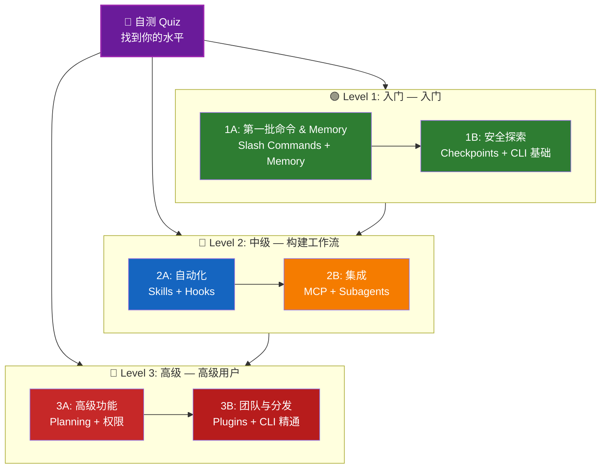

<picture>
  <source media="(prefers-color-scheme: dark)" srcset="resources/logos/claude-howto-logo-dark.svg">
  
</picture>

# Claude Code 学习路线图

**你是 Claude Code 新手？** 本指南帮助你按自己的节奏掌握 Claude Code 功能。无论你是完全的新手还是有经验的开发者，都从下面的自测 quiz 开始，找到适合你的路径。

---

## 找到你的水平

不是每个人都是从同一起点开始的。参加这个快速自测来找到正确的起点。

**诚实回答这些问题：**

- [ ] 我可以启动 Claude Code 并进行对话（`claude`）
- [ ] 我创建或编辑过 CLAUDE.md 文件
- [ ] 我使用过至少 3 个内置 slash commands（如 /help、/compact、/model）
- [ ] 我创建过自定义 slash command 或 skill（SKILL.md）
- [ ] 我配置过 MCP server（如 GitHub、数据库）
- [ ] 我在 ~/.claude/settings.json 中设置过 hooks
- [ ] 我创建或使用过自定义 subagents（.claude/agents/）
- [ ] 我使用过打印模式（`claude -p`）用于脚本或 CI/CD

**你的水平：**

| 勾选数 | 水平 | 从这里开始 | 完成时间 |
|--------|-------|----------|------------------|
| 0-2 | **Level 1: 入门** — 入门 | [Milestone 1A](#里程碑-1a-第一批命令--memory) | ~3小时 |
| 3-5 | **Level 2: 中级** — 构建工作流 | [Milestone 2A](#里程碑-2a-自动化-skills--hooks) | ~5小时 |
| 6-8 | **Level 3: 高级** — 高级用户和团队负责人 | [Milestone 3A](#里程碑-3a-高级功能) | ~5小时 |

> **提示**：如果不确定，从低一 level 开始。快速复习熟悉的材料比错过基础知识好。

> **交互版本**：在 Claude Code 中运行 `/self-assessment`，获得涵盖所有10个功能领域的引导式交互 quiz，并生成个性化学习路径。

---

## 学习理念

本仓库中的文件夹按**推荐学习顺序**编号，基于三个关键原则：

1. **依赖关系** - 基础知识在前
2. **复杂性** - 简单功能在前，复杂功能在后
3. **使用频率** - 最常用的功能先教

这种方法确保你在建立坚实基础的同时获得即时的生产力提升。

---

## 你的学习路径



**颜色图例：**
- 💜 紫色：自测 Quiz
- 🟢 绿色：Level 1 — 入门路径
- 🔵 蓝色/🟡 金色：Level 2 — 中级路径
- 🔴 红色：Level 3 — 高级路径

---

## 完整路线图表

| 步骤 | 功能 | 复杂度 | 时间 | 水平 | 依赖 | 为什么学这个 | 关键收益 |
|------|---------|-----------|------|-------|--------------|----------------|--------------|
| **1** | [Slash Commands](01-slash-commands/) | ⭐ 入门 | 30分钟 | Level 1 | 无 | 快速生产力提升（55+ 内置 + 5 捆绑 skills） | 即时自动化、团队标准 |
| **2** | [Memory](02-memory/) | ⭐⭐ 入门+ | 45分钟 | Level 1 | 无 | 所有功能的必备基础 | 持久化上下文、偏好 |
| **3** | [Checkpoints](08-checkpoints/) | ⭐⭐ 中级 | 45分钟 | Level 1 | 会话管理 | 安全探索 | 实验、恢复 |
| **4** | [CLI 基础](10-cli/) | ⭐⭐ 入门+ | 30分钟 | Level 1 | 无 | 核心 CLI 使用 | 交互和打印模式 |
| **5** | [Skills](03-skills/) | ⭐⭐ 中级 | 1小时 | Level 2 | Slash Commands | 自动专业知识 | 可复用能力、一致性 |
| **6** | [Hooks](06-hooks/) | ⭐⭐ 中级 | 1小时 | Level 2 | 工具、命令 | 工作流自动化（25事件、4类型） | 验证、质量门禁 |
| **7** | [MCP](05-mcp/) | ⭐⭐⭐ 中级+ | 1小时 | Level 2 | 配置 | 实时数据访问 | 实时集成、API |
| **8** | [Subagents](04-subagents/) | ⭐⭐⭐ 中级+ | 1.5小时 | Level 2 | Memory、命令 | 复杂任务处理（6个内置含 Bash） | 委托、专业知识 |
| **9** | [高级功能](09-advanced-features/) | ⭐⭐⭐⭐⭐ 高级 | 2-3小时 | Level 3 | 所有之前 | 高级用户工具 | Planning、Auto Mode、Channels、语音输入、权限 |
| **10** | [Plugins](07-plugins/) | ⭐⭐⭐⭐ 高级 | 2小时 | Level 3 | 所有之前 | 完整解决方案 | 团队入职、分发 |
| **11** | [CLI 精通](10-cli/) | ⭐⭐⭐ 高级 | 1小时 | Level 3 | 推荐：全部 | 精通命令行使用 | 脚本、CI/CD、自动化 |

**总学习时间**：约 11-13 小时（或跳到你的 level 节省时间）

---

## Level 1: 入门 — 入门

**适合**：答对 0-2 题的用户
**时间**：约 3 小时
**重点**：即时生产力、理解基础知识
**结果**：舒适的日常用户，准备进入 Level 2

### 里程碑 1A：第一批命令 & Memory

**主题**：Slash Commands + Memory
**时间**：1-2 小时
**复杂度**：⭐ 入门
**目标**：通过自定义命令和持久化上下文获得即时生产力提升

#### 你将实现
- 创建用于重复任务的自定义 slash commands
- 设置用于团队标准的项目 memory
- 配置个人偏好
- 理解 Claude 如何自动加载上下文

#### 实践练习

```bash
# 练习 1：安装你的第一个 slash command
mkdir -p .claude/commands
cp 01-slash-commands/optimize.md .claude/commands/

# 练习 2：创建项目 memory
cp 02-memory/project-CLAUDE.md ./CLAUDE.md

# 练习 3：试试看
# 在 Claude Code 中输入：/optimize
```

#### 成功标准
- [ ] 成功调用 `/optimize` 命令
- [ ] Claude 从 CLAUDE.md 记住你的项目标准
- [ ] 你理解了何时使用 slash commands vs. memory

#### 下一步
熟悉后，阅读：
- [01-slash-commands/README.md](01-slash-commands/README.md)
- [02-memory/README.md](02-memory/README.md)

> **检查你的理解**：在 Claude Code 中运行 `/lesson-quiz slash-commands` 或 `/lesson-quiz memory` 来测试你所学的内容。

---

### 里程碑 1B：安全探索

**主题**：Checkpoints + CLI 基础
**时间**：1 小时
**复杂度**：⭐⭐ 入门+
**目标**：学会安全实验和使用核心 CLI 命令

#### 你将实现
- 创建和恢复检查点以进行安全实验
- 理解交互模式 vs. 打印模式
- 使用基本 CLI 标志和选项
- 通过管道处理文件

#### 实践练习

```bash
# 练习 1：尝试检查点工作流
# 在 Claude Code 中：
# 进行一些实验性更改，然后按 Esc+Esc 或使用 /rewind
# 选择实验前的检查点
# 选择"恢复代码和对话"返回

# 练习 2：交互模式 vs 打印模式
claude "explain this project"           # 交互模式
claude -p "explain this function"       # 打印模式（非交互）

# 练习 3：通过管道处理文件内容
cat error.log | claude -p "explain this error"
```

#### 成功标准
- [ ] 创建并回退到检查点
- [ ] 使用过交互模式和打印模式
- [ ] 将文件通过管道传给 Claude 进行分析
- [ ] 理解了何时使用检查点进行安全实验

#### 下一步
- 阅读：[08-checkpoints/README.md](08-checkpoints/README.md)
- 阅读：[10-cli/README.md](10-cli/README.md)
- **准备好进入 Level 2！** 继续到 [里程碑 2A](#里程碑-2a-自动化-skills--hooks)

> **检查你的理解**：运行 `/lesson-quiz checkpoints` 或 `/lesson-quiz cli` 来验证你已准备好进入 Level 2。

---

## Level 2: 中级 — 构建工作流

**适合**：答对 3-5 题的用户
**时间**：约 5 小时
**重点**：自动化、集成、任务委托
**结果**：自动化工作流、外部集成，准备进入 Level 3

### 前提条件检查

在开始 Level 2 之前，确保你熟悉这些 Level 1 概念：

- [ ] 可以创建和使用 slash commands（[01-slash-commands/](01-slash-commands/)）
- [ ] 已通过 CLAUDE.md 设置项目 memory（[02-memory/](02-memory/)）
- [ ] 知道如何创建和恢复检查点（[08-checkpoints/](08-checkpoints/)）
- [ ] 可以从命令行使用 `claude` 和 `claude -p`（[10-cli/](10-cli/)）

> **有缺口？** 在继续之前回顾上面链接的教程。

---

### 里程碑 2A：自动化（Skills + Hooks）

**主题**：Skills + Hooks
**时间**：2-3 小时
**复杂度**：⭐⭐ 中级
**目标**：自动化常见工作流和质量检查

#### 你将实现
- 通过 YAML frontmatter（包括 `effort` 和 `shell` 字段）自动调用专业能力
- 跨 25 个 hook 事件设置事件驱动自动化
- 使用全部 4 种 hook 类型（command、http、prompt、agent）
- 强制执行代码质量标准
- 为你的工作流创建自定义 hooks

#### 实践练习

```bash
# 练习 1：安装一个 skill
cp -r 03-skills/code-review ~/.claude/skills/

# 练习 2：设置 hooks
mkdir -p ~/.claude/hooks
cp 06-hooks/pre-tool-check.sh ~/.claude/hooks/
chmod +x ~/.claude/hooks/pre-tool-check.sh

# 练习 3：在设置中配置 hooks
# 添加到 ~/.claude/settings.json：
{
  "hooks": {
    "PreToolUse": [
      {
        "matcher": "Bash",
        "hooks": [
          {
            "type": "command",
            "command": "~/.claude/hooks/pre-tool-check.sh"
          }
        ]
      }
    ]
  }
}
```

#### 成功标准
- [ ] 代码审查 skill 在相关时自动调用
- [ ] PreToolUse hook 在工具执行前运行
- [ ] 你理解了 skill 自动调用 vs. hook 事件触发

#### 下一步
- 创建你自己的自定义 skill
- 为你的工作流设置更多 hooks
- 阅读：[03-skills/README.md](03-skills/README.md)
- 阅读：[06-hooks/README.md](06-hooks/README.md)

> **检查你的理解**：在继续之前运行 `/lesson-quiz skills` 或 `/lesson-quiz hooks` 来测试你的知识。

---

### 里程碑 2B：集成（MCP + Subagents）

**主题**：MCP + Subagents
**时间**：2-3 小时
**复杂度**：⭐⭐⭐ 中级+
**目标**：集成外部服务和委托复杂任务

#### 你将实现
- 从 GitHub、数据库等访问实时数据
- 将工作委托给专业 AI agents
- 理解何时使用 MCP vs. subagents
- 构建集成工作流

#### 实践练习

```bash
# 练习 1：设置 GitHub MCP
export GITHUB_TOKEN="your_github_token"
claude mcp add github -- npx -y @modelcontextprotocol/server-github

# 练习 2：测试 MCP 集成
# 在 Claude Code 中：/mcp__github__list_prs

# 练习 3：安装 subagents
mkdir -p .claude/agents
cp 04-subagents/*.md .claude/agents/
```

#### 集成练习
尝试这个完整工作流：
1. 使用 MCP 获取 GitHub PR
2. 让 Claude 将审查委托给 code-reviewer subagent
3. 使用 hooks 自动运行测试

#### 成功标准
- [ ] 成功通过 MCP 查询 GitHub 数据
- [ ] Claude 将复杂任务委托给 subagents
- [ ] 你理解了 MCP 和 subagents 之间的区别
- [ ] 在工作流中组合了 MCP + subagents + hooks

#### 下一步
- 设置更多 MCP servers（数据库、Slack 等）
- 为你的领域创建自定义 subagents
- 阅读：[05-mcp/README.md](05-mcp/README.md)
- 阅读：[04-subagents/README.md](04-subagents/README.md)
- **准备好进入 Level 3！** 继续到 [里程碑 3A](#里程碑-3a-高级功能)

> **检查你的理解**：运行 `/lesson-quiz mcp` 或 `/lesson-quiz subagents` 来验证你已准备好进入 Level 3。

---

## Level 3: 高级 — 高级用户和团队负责人

**适合**：答对 6-8 题的用户
**时间**：约 5 小时
**重点**：团队工具、CI/CD、企业功能、plugin 开发
**结果**：高级用户，可以设置团队工作流和 CI/CD

### 前提条件检查

在开始 Level 3 之前，确保你熟悉这些 Level 2 概念：

- [ ] 可以创建和使用带自动调用的 skills（[03-skills/](03-skills/)）
- [ ] 已设置事件驱动自动化的 hooks（[06-hooks/](06-hooks/)）
- [ ] 可以配置用于外部数据的 MCP servers（[05-mcp/](05-mcp/)）
- [ ] 知道如何使用 subagents 进行任务委托（[04-subagents/](04-subagents/)）

> **有缺口？** 在继续之前回顾上面链接的教程。

---

### 里程碑 3A：高级功能

**主题**：高级功能（Planning、权限、Extended Thinking、Auto Mode、Channels、Voice Dictation、Remote/Desktop/Web）
**时间**：2-3 小时
**复杂度**：⭐⭐⭐⭐⭐ 高级
**目标**：掌握高级工作流和高级用户工具

#### 你将实现
- 使用 Planning mode 进行复杂功能
- 通过 6 种模式进行细粒度权限控制（default、acceptEdits、plan、auto、dontAsk、bypassPermissions）
- 通过 Alt+T / Option+T 切换 Extended thinking
- 后台任务管理
- Auto Memory 学习偏好
- 带后台安全分类器的 Auto Mode
- 用于结构化多会话工作流的 Channels
- 用于免手操作的 Voice Dictation
- Remote control、desktop app 和 web sessions
- 用于多 agent 协作的 Agent Teams

#### 实践练习

```bash
# 练习 1：使用 planning mode
/plan Implement user authentication system

# 练习 2：尝试权限模式（6种可用：default、acceptEdits、plan、auto、dontAsk、bypassPermissions）
claude --permission-mode plan "analyze this codebase"
claude --permission-mode acceptEdits "refactor the auth module"
claude --permission-mode auto "implement the feature"

# 练习 3：启用 extended thinking
# 在会话期间按 Alt+T（macOS 上为 Option+T）切换

# 练习 4：高级检查点工作流
# 1. 创建检查点 "Clean state"
# 2. 使用 planning mode 设计功能
# 3. 通过 subagent 委托实现
# 4. 在后台运行测试
# 5. 如果测试失败，回退到检查点
# 6. 尝试替代方案

# 练习 5：尝试 auto mode（后台安全分类器）
claude --permission-mode auto "implement user settings page"

# 练习 6：启用 agent teams
export CLAUDE_AGENT_TEAMS=1
# 问 Claude："Implement feature X using a team approach"

# 练习 7：计划任务
/loop 5m /check-status
# 或使用 CronCreate 进行持久化计划任务

# 练习 8：Channels 用于多会话工作流
# 使用 channels 跨会话组织工作

# 练习 9：Voice Dictation
# 使用语音输入与 Claude Code 进行免手交互
```

#### 成功标准
- [ ] 使用 planning mode 完成复杂功能
- [ ] 配置了权限模式（plan、acceptEdits、auto、dontAsk）
- [ ] 通过 Alt+T / Option+T 切换 extended thinking
- [ ] 使用带后台安全分类器的 auto mode
- [ ] 使用后台任务进行长时间操作
- [ ] 探索了 Channels 用于多会话工作流
- [ ] 尝试了 Voice Dictation 进行免手输入
- [ ] 理解了 Remote Control、Desktop App 和 Web sessions
- [ ] 启用并使用了 Agent Teams 进行协作任务
- [ ] 使用 `/loop` 进行重复任务或计划监控

#### 下一步
- 阅读：[09-advanced-features/README.md](09-advanced-features/README.md)

> **检查你的理解**：运行 `/lesson-quiz advanced` 来测试你对高级用户功能的掌握。

---

### 里程碑 3B：团队与分发（Plugins + CLI 精通）

**主题**：Plugins + CLI 精通 + CI/CD
**时间**：2-3 小时
**复杂度**：⭐⭐⭐⭐ 高级
**目标**：构建团队工具、创建 plugins、精通 CI/CD 集成

#### 你将实现
- 安装和创建完整打包 plugins
- 精通 CLI 用于脚本和自动化
- 通过 `claude -p` 设置 CI/CD 集成
- JSON 输出用于自动化 pipeline
- 会话管理和批处理

#### 实践练习

```bash
# 练习 1：安装完整 plugin
# 在 Claude Code 中：/plugin install pr-review

# 练习 2：用于 CI/CD 的打印模式
claude -p "Run all tests and generate report"

# 练习 3：用于脚本的 JSON 输出
claude -p --output-format json "list all functions"

# 练习 4：会话管理和恢复
claude -r "feature-auth" "continue implementation"

# 练习 5：带约束的 CI/CD 集成
claude -p --max-turns 3 --output-format json "review code"

# 练习 6：批处理
for file in *.md; do
  claude -p --output-format json "summarize this: $(cat $file)" > ${file%.md}.summary.json
done
```

#### CI/CD 集成练习
创建一个简单的 CI/CD 脚本：
1. 使用 `claude -p` 审查更改的文件
2. 将结果输出为 JSON
3. 用 `jq` 处理以获取特定问题
4. 集成到 GitHub Actions 工作流

#### 成功标准
- [ ] 安装并使用了 plugin
- [ ] 为你的团队构建或修改了 plugin
- [ ] 在 CI/CD 中使用了打印模式（`claude -p`）
- [ ] 生成了用于脚本的 JSON 输出
- [ ] 成功恢复了之前的会话
- [ ] 创建了批处理脚本
- [ ] 将 Claude 集成到 CI/CD 工作流

#### CLI 的真实使用场景
- **代码审查自动化**：在 CI/CD pipeline 中运行代码审查
- **日志分析**：分析错误日志和系统输出
- **文档生成**：批量生成文档
- **测试洞察**：分析测试失败
- **性能分析**：审查性能指标
- **数据处理**：转换和分析数据文件

#### 下一步
- 阅读：[07-plugins/README.md](07-plugins/README.md)
- 阅读：[10-cli/README.md](10-cli/README.md)
- 创建团队范围的 CLI 快捷方式和 plugins
- 设置批处理脚本

> **检查你的理解**：运行 `/lesson-quiz plugins` 或 `/lesson-quiz cli` 来确认你的精通。

---

## 测试你的知识

本仓库包含两个交互式 skills，你可以随时在 Claude Code 中使用来评估你的理解：

| Skill | 命令 | 用途 |
|-------|---------|---------|
| **Self-Assessment** | `/self-assessment` | 评估你在所有10个功能领域的整体水平。选择快速（2分钟）或深入（5分钟）模式，获得个性化技能档案和学习路径。 |
| **Lesson Quiz** | `/lesson-quiz [lesson]` | 用 8-10 个问题测试你对特定课程的理解。可在课程前（前测）、课程中（进度检查）或课程后（精通验证）使用。 |

**示例：**
```
/self-assessment                  # 找到你的整体水平
/lesson-quiz hooks                # 关于 Lesson 06: Hooks 的 quiz
/lesson-quiz 03                   # 关于 Lesson 03: Skills 的 quiz
/lesson-quiz advanced-features    # 关于 Lesson 09 的 quiz
```

---

## 快速开始路径

### 如果你只有 15 分钟
**目标**：获得你的第一次成功

1. 复制一个 slash command：`cp 01-slash-commands/optimize.md .claude/commands/`
2. 在 Claude Code 中试用：`/optimize`
3. 阅读：[01-slash-commands/README.md](01-slash-commands/README.md)

**结果**：你将拥有一个可用的 slash command 并理解基础知识

---

### 如果你有 1 小时
**目标**：设置基本生产力工具

1. **Slash commands**（15分钟）：复制并测试 `/optimize` 和 `/pr`
2. **项目 memory**（15分钟）：用你的项目标准创建 CLAUDE.md
3. **安装 skill**（15分钟）：设置 code-review skill
4. **一起试用**（15分钟）：看它们如何协同工作

**结果**：通过命令、memory 和自动 skills 实现基本生产力提升

---

### 如果你有一个周末
**目标**：熟练掌握大部分功能

**周六上午**（3小时）：
- 完成里程碑 1A：Slash Commands + Memory
- 完成里程碑 1B：Checkpoints + CLI 基础

**周六下午**（3小时）：
- 完成里程碑 2A：Skills + Hooks
- 完成里程碑 2B：MCP + Subagents

**周日**（4小时）：
- 完成里程碑 3A：高级功能
- 完成里程碑 3B：Plugins + CLI 精通 + CI/CD
- 为你的团队构建自定义 plugin

**结果**：你将成为一名可以培训他人和自动化复杂工作流的 Claude Code 高级用户

---

## 学习技巧

### 应该做

- **先做 quiz** 找到你的起点
- **完成每个里程碑的实践练习**
- **从简单开始** 逐步增加复杂性
- **每个功能都测试一下** 再进入下一个
- **做笔记** 记录什么适合你的工作流
- **在学习高级主题时回顾** 早期概念
- **使用检查点安全实验**
- **与你的团队分享知识**

### 不应该做

- **跳过前提条件检查** 当跳到更高 level 时
- **试图一次学完所有内容** — 会让人不知所措
- **不理解就复制配置** — 你不会知道如何调试
- **忘记测试** — 始终验证功能是否有效
- **匆忙完成里程碑** — 花时间理解
- **忽略文档** — 每个 README 都有有价值的细节
- **孤立工作** — 与队友讨论

---

## 学习风格

### 视觉学习者
- 学习每个 README 中的 mermaid 图
- 观察命令执行流程
- 绘制你自己的工作流图
- 使用上面的可视化学习路径

### 实践学习者
- 完成每个实践练习
- 尝试变体
- 破坏并修复它们（使用检查点！）
- 创建你自己的示例

### 阅读学习者
- 仔细阅读每个 README
- 研究代码示例
- 回顾对比表
- 阅读资源中链接的博客文章

### 社交学习者
- 设置结对编程会话
- 向队友教授概念
- 加入 Claude Code 社区讨论
- 分享你的自定义配置

---

## 进度跟踪

使用这些清单按 level 跟踪你的进度。在任何时候运行 `/self-assessment` 获取更新的技能档案，或在每个教程后运行 `/lesson-quiz [lesson]` 来验证你的理解。

### Level 1: 入门
- [ ] 完成 [01-slash-commands](01-slash-commands/)
- [ ] 完成 [02-memory](02-memory/)
- [ ] 创建第一个自定义 slash command
- [ ] 设置项目 memory
- [ ] **里程碑 1A 已达成**
- [ ] 完成 [08-checkpoints](08-checkpoints/)
- [ ] 完成 [10-cli](10-cli/) 基础
- [ ] 创建并回退到检查点
- [ ] 使用交互模式和打印模式
- [ ] **里程碑 1B 已达成**

### Level 2: 中级
- [ ] 完成 [03-skills](03-skills/)
- [ ] 完成 [06-hooks](06-hooks/)
- [ ] 安装第一个 skill
- [ ] 设置 PreToolUse hook
- [ ] **里程碑 2A 已达成**
- [ ] 完成 [05-mcp](05-mcp/)
- [ ] 完成 [04-subagents](04-subagents/)
- [ ] 连接 GitHub MCP
- [ ] 创建自定义 subagent
- [ ] 在工作流中组合集成
- [ ] **里程碑 2B 已达成**

### Level 3: 高级
- [ ] 完成 [09-advanced-features](09-advanced-features/)
- [ ] 成功使用 planning mode
- [ ] 配置了权限模式（包括 auto 的 6 种模式）
- [ ] 使用带安全分类器的 auto mode
- [ ] 使用 extended thinking 切换
- [ ] 探索了 Channels 和 Voice Dictation
- [ ] **里程碑 3A 已达成**
- [ ] 完成 [07-plugins](07-plugins/)
- [ ] 完成 [10-cli](10-cli/) 高级用法
- [ ] 设置打印模式（`claude -p`）CI/CD
- [ ] 创建用于自动化的 JSON 输出
- [ ] 将 Claude 集成到 CI/CD pipeline
- [ ] 创建团队 plugin
- [ ] **里程碑 3B 已达成**

---

## 常见学习挑战

### 挑战 1："一次太多概念"
**解决方案**：一次专注于一个里程碑。移动前进之前完成所有练习。

### 挑战 2："不知道什么时候用什么功能"
**解决方案**：参阅主 README 中的[使用场景矩阵](README.md#use-case-matrix)。

### 挑战 3："配置不工作"
**解决方案**：查看[故障排除](README.md#troubleshooting)部分并验证文件位置。

### 挑战 4："概念似乎重叠"
**解决方案**：回顾[功能对比](README.md#feature-comparison)表来理解差异。

### 挑战 5："很难记住所有东西"
**解决方案**：创建你自己的速查表。使用检查点安全实验。

### 挑战 6："我有经验但不知道从哪里开始"
**解决方案**：参加上面的[自测 Quiz](#找到你的水平)。跳到你的 level 并使用前提条件检查来识别任何缺口。

---

## 完成后下一步

完成所有里程碑后：

1. **创建团队文档** — 记录你团队的 Claude Code 设置
2. **构建自定义 plugins** — 打包你团队的工作流
3. **探索 Remote Control** — 从外部工具编程控制 Claude Code 会话
4. **尝试 Web Sessions** — 通过基于浏览器的界面使用 Claude Code 进行远程开发
5. **使用 Desktop App** — 通过原生桌面应用程序访问 Claude Code 功能
6. **使用 Auto Mode** — 让 Claude 在后台安全分类器的监督下自主工作
7. **利用 Auto Memory** — 让 Claude 随着时间自动学习你的偏好
8. **设置 Agent Teams** — 在复杂、多方面的任务上协调多个 agents
9. **使用 Channels** — 在结构化多会话工作流中组织工作
10. **尝试 Voice Dictation** — 使用免手语音输入与 Claude Code 交互
11. **使用计划任务** — 通过 `/loop` 和 cron 工具自动化重复检查
12. **贡献示例** — 与社区分享
13. **指导他人** — 帮助队友学习
14. **优化工作流** — 根据使用情况持续改进
15. **保持更新** — 关注 Claude Code 发布和新功能

---

## 更多资源

### 官方文档
- [Claude Code 文档](https://code.claude.com/docs/en/overview)
- [Anthropic 文档](https://docs.anthropic.com)
- [MCP Protocol 规范](https://modelcontextprotocol.io)

### 博客文章
- [Discovering Claude Code Slash Commands](https://medium.com/@luongnv89/discovering-claude-code-slash-commands-cdc17f0dfb29)

### 社区
- [Anthropic Cookbook](https://github.com/anthropics/anthropic-cookbook)
- [MCP Servers 仓库](https://github.com/modelcontextprotocol/servers)

---

## 反馈和支持

- **发现问题？** 在仓库中创建 issue
- **有建议？** 提交 pull request
- **需要帮助？** 查看文档或询问社区

---

**最后更新**：2026年3月
**维护者**：Claude How-To 贡献者
**许可证**：教育目的，免费使用和改编

---

[← 返回主 README](README.md)
