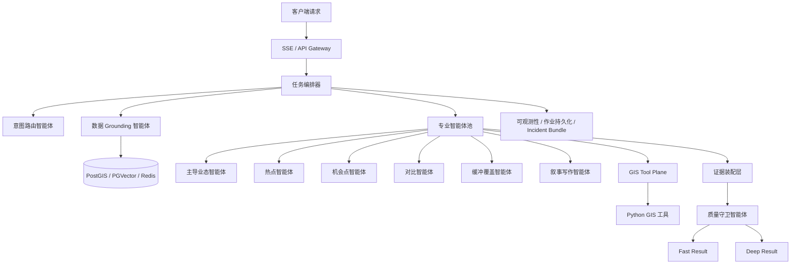

# V2 智能体架构总览

> 日期：2026-03-09  
> 范围：`V2-Agent-backend`

## 当前实现状态（2026-03-09）

- V2 现已具备可运行的 `Task Orchestrator`，不再仅是模板驱动工具执行器。
- 新路径默认已覆盖 6 个 objective：`area_briefing`、`compare_analysis`、`hotspot_analysis`、`opportunity_discovery`、`buffer_export_workflow`、`coverage_gap_analysis`。
- Grounding 默认优先连接真实 PostGIS `public.pois`，并在数据库不可用时回退 sample dataset。
- 已落地 structured evidence contract、quality guard、routing/no-data evaluator、execution policy 与 performance baseline。
- 当前代码与测试状态以仓库实现为准；本文后续章节保留原始设计目标与原则。

## 1. 背景

当前 V2 已经在实现方式上与 V1 拉开差异，具备：

- 意图路由
- 模板重排
- DSL 校验
- 工具链执行
- 异步 deep lane
- 缓存、作业持久化、可观测性

但从本质上看，当前 V2 更像“模板驱动的工具执行器”，还不是“目标驱动的智能体编排系统”。

这与我们希望中的 V2 存在差距：

- V2 应该与 V1 在架构上不同，但不能在职能上更弱。
- V1 能做的，V2 必须都能做。
- V2 应具备 V1 没有的智能体能力，例如主动取数、自主拆解、质量守卫、多智能体协作。
- V2 不能在“无相关数据”这一步只靠前端输入或启发式判断，而应主动查询 PostGIS。

## 2. 核心定位

V2 的定位不是：

- V1 的重写版
- 功能更少的实验分支
- 一个泛泛而谈的“智能体壳”

V2 的正确定位是：

**职能同构、执行异构、能力超集。**

具体解释：

- **职能同构**：V1 能做的业务问题，V2 全部要能做。
- **执行异构**：V2 不沿用 V1 的内部实现方式，而采用编排式智能体架构。
- **能力超集**：V2 增加主动 grounding、自主拆解、多智能体协作、置信守卫与异步增强能力。

## 3. 设计目标

V2 的目标是构建一个：

**业务覆盖不低于 V1，但执行更快、更自主、更有证据意识的智能体后端。**

一句话概括：

**V2 应该在不要求用户手动补数据的情况下，主动完成空间数据 grounding、调度专业智能体，并在时间预算内产出业务可读结论。**

## 4. 目标能力

V2 必须覆盖至少以下业务能力：

- 当前片区总结
- POI 类别分析
- 活力热点分析
- 机会点发现
- 区域对比
- 缓冲、合并、导出等空间操作
- 证据化响应
- 叙事化说明

此外，V2 需要新增：

- 主动查库
- 任务级编排
- 多智能体并行分析
- 回答质量守卫
- 快慢双车道输出

## 5. 高层架构

## 6. V1 与 V2 的本质差异

| 维度 | V1 | V2 |
|---|---|---|
| 系统形态 | 请求驱动 | 目标驱动 |
| 核心执行方式 | 固定流程 / 服务组合 | 编排器 + 专业智能体 |
| 数据依赖 | 更依赖前端上下文 | 主动 PostGIS grounding |
| 回答逻辑 | 先算再说 | 先判目标再调度 |
| 结果形式 | 结果摘要 | 业务快评 + 证据说明 |
| 深度增强 | 有限 | 默认支持 fast/deep 双车道 |

## 7. 核心原则

### 7.1 职能同构

V2 不允许在业务问题覆盖上弱于 V1。

### 7.2 执行异构

V2 的重点不是“换一套接口名字”，而是换一套内部决策与执行模型。

### 7.3 能力超集

V2 应具备：

- 主动取数
- 自主拆解
- 多智能体协同
- 证据优先
- 回答置信守卫

### 7.4 先取数，再判无数据

V2 对片区分析类问题，必须先查询数据库、扩圈、回退，再允许给出“无相关数据”判断。

### 7.5 快慢双车道

- Fast lane：先给用户最核心结论
- Deep lane：再补证据、细节和更稳的解释

## 8. 契约闭环

V2 的契约闭环必须固定为以下链路：

`request -> intent route -> objective contract -> grounding result -> specialist results -> quality decision -> public response -> job snapshot`

各段职责边界如下：

| 阶段 | 输入 | 输出 | 负责模块 | 边界说明 |
|---|---|---|---|---|
| Request intake | 用户 query、session、viewport/AOI | 标准化请求上下文 | API Gateway / Task Orchestrator | 只做接入标准化，不在此阶段推断业务结论 |
| Intent route | 标准化请求上下文 | objective routing output | Intent Router | 只判断目标类型和执行候选，不负责对外话术 |
| Objective contract | routing output、上下文、默认策略 | 可执行 objective contract | Task Orchestrator | 这是唯一合法的下游执行入口 |
| Grounding result | objective contract、AOI、数据源 | grounding result contract | Data Grounding Agent | 输出数据充分性、检索过程和工作数据集引用 |
| Specialist results | grounding result、objective contract | specialist result contracts | 专业智能体池 | 每个智能体只输出本专业 section，不越权汇总 |
| Quality decision | specialist results、grounding result、policy | quality decision contract | Quality Guard | 给出裁决，不直接生成最终用户文案 |
| Public response | quality decision、specialist results | SSE public response events | Task Orchestrator + Narrative Writer | 输出对外快照，必须遵守 artifact 与证据约束 |
| Job snapshot | 全部事件和状态 | `/api/v2/jobs/:jobId` 物化快照 | Task Orchestrator / Job Store | 是 SSE 事件的持久化投影，不是另一套独立协议 |

约束结论：

- 没有 objective contract，不允许进入新智能体路径。
- 没有 grounding result，不允许片区分析类任务直接宣告“无数据”。
- 没有 quality decision，不允许对外输出高置信结论。
- `/api/v2/jobs/:jobId` 必须能回溯到同一任务的 SSE 事件终态。

## 9. 决策所有权

V2 中三个关键模块的裁决权必须明确，避免“谁都能改最终答案”的隐式耦合。

### 9.1 `Intent Router Agent`

- 负责识别 objective 和路由候选。
- 可以输出置信度和路由特征。
- **不负责**：
  - 选择最终对外话术
  - 批准 artifact 承诺
  - 决定是否 handoff legacy

### 9.2 `Task Orchestrator Agent`

- 负责：
  - 组装 objective contract
  - 控制 fast/deep 路径
  - 分配时间预算
  - 聚合 specialist results
  - 决定是否执行 fallback
  - 输出 public response 和 job snapshot
- 它是唯一的任务入口，也是唯一的结果出口。

### 9.3 `Quality Guard Agent`

- 负责裁决结果可否直接对外输出。
- 合法裁决只有：
  - `pass`
  - `conditional`
  - `narrow_scope`
  - `handoff_legacy`
  - `no_data`
- **不直接**修改 SSE 事件协议。
- **不直接**替代编排器做聚合。
- `handoff_legacy` 一旦成立，编排器必须停止继续承诺新的 deep 路径价值。

## 10. 本地 rollout 边界与兼容不变式

本节只定义本地测试和联调边界，不涉及生产灰度方案。

### 10.1 本地 rollout 边界

- 新智能体路径默认只放行 `area_briefing`。
- 非白名单 objective 默认走 legacy 兼容路径。
- 以下情况必须进入 legacy 兼容路径：
  - objective 不在 allowlist 中
  - 目标能力尚未完成与 V1 对齐
  - grounding 无法满足最低数据充分性且没有合法降级结果
  - `Quality Guard` 判定为 `handoff_legacy`

### 10.2 当前默认 allowlist

| objective | 默认路径 | 说明 |
|---|---|---|
| `area_briefing` | new agent path | 第一阶段旗舰场景，默认放行 |
| `hotspot_analysis` | legacy path | 待补完整契约后再放行 |
| `opportunity_discovery` | legacy path | 待补完整契约后再放行 |
| `compare_analysis` | legacy path | 待补对比契约与回退矩阵 |
| `buffer_export_workflow` | legacy path | 待补 artifact contract 与完整导出语义 |
| `coverage_gap_analysis` | legacy path | 待补覆盖缺口专属 grounding 和 quality 规则 |

### 10.3 对外兼容不变式

在文档补完阶段，以下外部接口保持不变：

- HTTP 路径：
  - `POST /api/v2/analysis`
  - `GET /api/v2/jobs/:jobId`
- SSE 事件名：
  - `fast.result`
  - `deep.accepted`
  - `deep.patch`
  - `deep.final`
  - `deep.failed`
- job 快照主字段：
  - `fast_result`
  - `deep_partial`
  - `deep_final`

### 10.4 对外兼容含义

- 文档可以扩展字段，但不定义 breaking change。
- 文档可以抽象现有实现，但不能暗示当前代码已经完成模块拆分。
- artifact 相关文案必须增量收紧：只有真实 artifact 存在且任务确属 artifact 类时，才能对外承诺“文件可用”。

## 11. V2 的旗舰场景

V2 第一阶段最应该打透的场景是：

`请在 30 秒内给我这片区的关键结论：主导业态、活力热点、最值得关注的机会点。`

这是最能体现 V2 与 V1 差异的场景，因为它要求：

- 不让用户传数据
- 主动查库
- 拆分多个分析任务
- 合成业务可读结论
- 在 30 秒内完成

## 12. 总体结论

V2 的正确发展方向不是继续做“更复杂的模板系统”，而是：

**收敛成一个有边界的、多智能体协作的、主动 grounding 的空间智能分析后端。**

这条路线要真正可实施，必须同时满足三件事：

- 契约闭环清楚
- 本地 rollout 边界清楚
- 对外兼容不变式清楚

只有这三点同时成立，后续模块拆分、接口设计和阶段实施才不会再次漂移。
