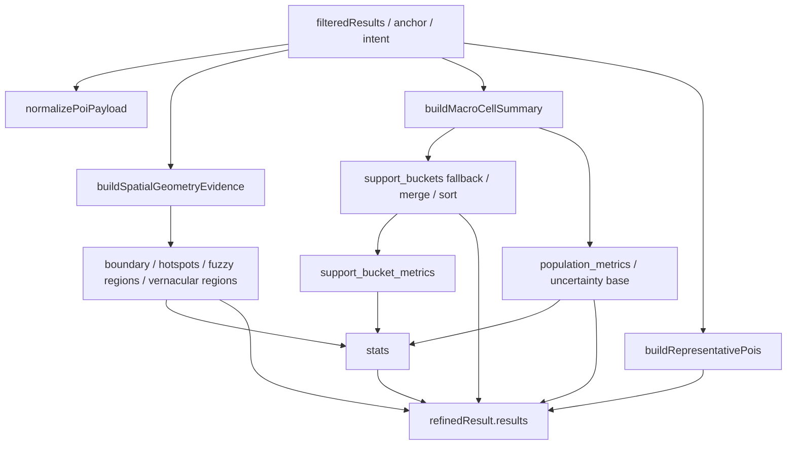

# spatial-evidence dataflow

## Scope

本文档只描述当前 `buildSpatialEvidence()` 的真实数据流，目标是回答：

1. evidence bundle 由哪些输入组成
2. 哪些依赖来自纯能力模块
3. 哪些依赖仍然来自 `rules_line`
4. 哪些地方适合未来下沉到 `spatial_core`

关键入口：

- [chatPipeline.js](D:/AAA_Edu/TagCloud/vite-project/V3-GeoEncoder-RAG/services/ai/chatPipeline.js#L531)

## Current Inputs

`buildSpatialEvidence()` 当前接收：

- `intent`
- `anchor`
- `candidateResults`
- `filteredResults`
- `spatialContext`
- `poiFeatures`
- `queryEmbedding`
- `macroCellSearch`
- `runtimeEnrichment`
- `cellContextEnrichment`
- `routeExecutor`
- `comparisonRegions`
- `surfaceContext`
- `surfaceConstraint`

这些输入本身已经说明：它不是 planner，而是一次执行完成后的“证据归档器”。

## High-level Flow

## Dependency Breakdown

### 1. Geometry / spatial layers

来源：

- [spatialEvidenceService.js](D:/AAA_Edu/TagCloud/vite-project/V3-GeoEncoder-RAG/services/retrieval/spatialEvidenceService.js#L1)

职责：

- 结果点集 -> boundary
- vernacular regions / fuzzy regions
- boundary confidence
- vector constraint summary

判断：

- 这是典型的 `spatial_core.build_boundary` 候选能力
- 但当前文件内聚度很高，还混有 surface support、encoder consistency、polygon 几何处理
- 需要按函数粒度拆分，而不是整文件搬迁

### 2. support bucket / macro summary

来源：

- [supportEvidenceUtils.js](D:/AAA_Edu/TagCloud/vite-project/V3-GeoEncoder-RAG/services/rules_line/ai/supportEvidenceUtils.js#L1)

职责：

- `buildMacroCellSummary`
- `summarizeSupportBuckets`
- `enrichSupportBucketsWithResults`
- `sortSupportBucketsForTask`
- `buildSupportBucketMetrics`
- `buildVerifiedSupportBucketMetrics`
- `buildRepresentativePois`
- `buildMacroUncertainty`
- `normalizeMacroUncertainty`

判断：

- 这些函数虽然位于 `rules_line/ai/`，但大部分本质上是 evidence assembly 逻辑，不是旧 answer rule
- 它们是当前 `buildSpatialEvidence()` 最大的拆分阻力
- 不能让 `spatial_core` 直接长期依赖这个文件路径

建议：

- 未来收敛成 1 个高层模块，例如 `spatial_core/evidenceAssembler.js`
- 外部入口只暴露类似：
  - `buildEvidenceBundle({ pois, macroResult, geometryResult, intent })`

### 3. query plan / stats

来源：

- [chatPipeline.js](D:/AAA_Edu/TagCloud/vite-project/V3-GeoEncoder-RAG/services/ai/chatPipeline.js#L641)

职责：

- 生成执行后 `query_plan`
- 聚合 stats

判断：

- 这是“执行结果摘要”，不是 planner schema
- 未来应保留在 evidence / answer synthesis 侧
- 不应与 `planner_line` 的 step-based plan 混用

## Explicit Warning

当前 evidence 组装链中仍有 `rules_line` 依赖：

- [chatPipeline.js](D:/AAA_Edu/TagCloud/vite-project/V3-GeoEncoder-RAG/services/ai/chatPipeline.js#L2)

这在 B 阶段可以接受，但到了 C/D 不能继续扩大。

特别是：

1. 不应让 `spatial_core.build_boundary` 直接长期 import `rules_line/ai/supportEvidenceUtils.js`
2. 不应让 planner_line 在 answer synthesis 中重新依赖旧 `spatialAnswerService`

## Recommended Next Extraction Order

1. 提取纯几何 helpers
   - `toCoordinatePair`
   - `averageCoordinatePairs`
   - polygon / hull / ring helpers

2. 提取 evidence assembly helpers
   - representative pois
   - support bucket normalization
   - macro uncertainty normalization

3. 保留 task-sensitive 排序逻辑为 adapter
   - `sortSupportBucketsForTask`
   - 这些逻辑要单独审查，确认是否属于“证据整理”还是“旧任务判断”

## B3 Conclusion

`buildSpatialEvidence()` 当前是：

- planner_line 后续 answer synthesis 的重要输入源
- 但还不是一个已经从 `rules_line` 脱钩的稳定能力层

它的正确迁移方向是：

- 把纯能力和 evidence assembly 下沉
- 保留最少量过渡 adapter
- 避免把整个旧 answer/evidence 逻辑当黑盒直接挂到新线
