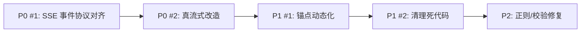

# V3-GeoEncoder-RAG 前端集成诊断报告

> **诊断时间**: 2026-03-22  
> **诊断范围**: V3 后端 ↔ 前端 (Vue 3 + Vite) 全链路集成

---

## 🔴 严重问题 (P0 - 集成不可用)

### 1. Vite Proxy 端口硬编码指向 V1 后端

**位置**: [vite.config.js](file:///d:/AAA_Edu/TagCloud/vite-project/vite.config.js#L81-L104)

```diff
 server: {
   port: 3000,
   strictPort: true,
   proxy: {
     '/api/ai': {
-      target: 'http://127.0.0.1:3200',   // ← V1 后端端口
+      target: 'http://127.0.0.1:3300',   // ← V3 后端端口
       changeOrigin: true,
       timeout: 120000,
     },
```

**问题本质**: `vite.config.js` 中所有 4 条 proxy 规则都硬编码指向 `3200`（V1 后端），但 V3 后端运行在 `3300` 端口。虽然 `.env` 中设置了 `VITE_DEV_API_BASE=http://127.0.0.1:3300`，且 `config.js` 确实读取了这个变量，**但 proxy 规则在 `mode=v3` 下仍然指向 `3200`**。

**影响**:
- 当前端以 `--mode v3` 启动时，**proxy 不会生效于 V3**（因为 `config.js` 直接拼接了完整 URL `http://127.0.0.1:3300/api/ai/...`，**绕过了 proxy**）
- 这意味着前端直接跨域请求 V3 后端，虽然 V3 配了 `cors: '*'`，但丢失了 proxy 的 timeout 和 failover 能力
- **生产构建完全不可用** — Vercel Rewrite 指向 `/proxy-api`，但 V3 后端没有部署策略

**建议**: 为 `v3` mode 增加独立 proxy 配置，或确认直连策略是有意为之。

---

### 2. SSE 事件协议不对齐 — V3 缺少前端期望的核心事件

**位置**: 
- V3 后端 [server.js#L100-L148](file:///d:/AAA_Edu/TagCloud/vite-project/V3-GeoEncoder-RAG/server.js#L100-L148) — 仅发送 `meta`, `stage`, `text`, `done`, `error`
- 前端 [useAiStreamDispatcher.js](file:///d:/AAA_Edu/TagCloud/vite-project/src/composables/ai/useAiStreamDispatcher.js) — 期望 `pois`, `boundary`, `spatial_clusters`, `vernacular_regions`, `fuzzy_regions`, `stats`, `refined_result`, `partial`, `progress`

| 前端期望的事件 | V3 是否发送 | 影响 |
|---|---|---|
| `meta` (含 traceId) | ✅ 发送 | — |
| `stage` (含 name/label/hint) | ✅ 发送 | — |
| `text` (含 content) | ✅ 发送 | — |
| `done` | ✅ 发送 | — |
| `pois` | ❌ **不发送** | 前端标签云组件 `EmbeddedTagCloud` 永远不会渲染 |
| `boundary` | ❌ **不发送** | 前端地图不会显示分析边界 |
| `spatial_clusters` | ❌ **不发送** | 空间聚类热力图缺失 |
| `vernacular_regions` | ❌ **不发送** | 俗称区域不显示 |
| `stats` / `refined_result` | ❌ **不发送** | 分析看板 (`SpatialEvidenceCard`) 永远显示「等待空间证据」 |
| `thinking` / `reasoning` | ❌ **不发送** | 前端思考过程 UI 无数据 |

**影响**: V3 模式下，**前端只能显示纯文本聊天**。所有空间分析可视化组件（标签云、聚类、边界、热力图、分析看板）均为空/不渲染。

---

### 3. 空间查询结果是「假流式」— 先全量完成再分块发送

**位置**: [server.js#L129-L147](file:///d:/AAA_Edu/TagCloud/vite-project/V3-GeoEncoder-RAG/server.js#L129-L147)

```javascript
// 阶段 3：答案生成（流式）
const answer = askResult.answer;    // ← 整个答案已经生成完毕
const chunkSize = 15;

for (let i = 0; i < answer.length; i += chunkSize) {
  const chunk = answer.slice(i, i + chunkSize);
  sendEvent('text', { content: chunk });
  await new Promise(r => setTimeout(r, 20));   // ← 人工 20ms 延迟模拟打字
}
```

**问题**: 空间查询路径 `handleSpatialQuery()` 是同步执行整个 pipeline（意图解析 → 混合检索 → 语义筛选 → 答案生成），然后拿到 **完整的 `answer` 字符串** 后再分 15 字符一块发送。用户在「意图理解」和「空间检索」阶段看到的是真实等待，但「答案生成」阶段是伪流式。

**影响**: 首字延迟（TTFB）包含了完整 pipeline 延迟（意图解析 LLM + PostGIS 查询 + 语义筛选 LLM + 答案生成 LLM），可能 **10-30 秒**。

---

## 🟠 中度问题 (P1 - 功能受限)

### 4. `stage` 事件映射不完整 — V3 有 `reasoning` 阶段但后端从未发送

**位置**: 
- 前端定义了 V3 阶段 [AiChat.vue#L382-L387](file:///d:/AAA_Edu/TagCloud/vite-project/src/components/AiChat.vue#L382-L387):
  ```javascript
  const v3StageSteps = [
    { key: 'intent', label: '意图理解' },
    { key: 'spatial', label: '空间检索' },
    { key: 'reasoning', label: '空间推理' },   // ← 前端定义了
    { key: 'answer', label: '答案生成' },
  ];
  ```
- V3 后端只发送 `intent`, `spatial`, `answer` 三个 stage，**从不发送 `reasoning`**

**影响**: 前端 Pipeline Tracker 的「空间推理」步骤永远不会被激活，直接从「空间检索」跳到「答案生成」。

---

### 5. 前端 `sendMessage()` 传递了大量 V1 专属参数，V3 完全忽略

**位置**: [AiChat.vue#L904-L951](file:///d:/AAA_Edu/TagCloud/vite-project/src/components/AiChat.vue#L904-L951)

前端 `sendMessage()` 构建了一个庞大的 `options` 对象，包含：

```javascript
options = {
  visualReviewEnabled: deepSpatialMode,
  visualRemoteEnabled: Boolean(deepSpatialMode && screenshotBase64),
  selfValidationEnabled: deepSpatialMode,
  skgEnabled: deepSpatialMode,
  nameAuditEnabled: true,
  visualSnapshotDataUrl: screenshotBase64,   // 可能包含 base64 截图数据
  screenshotBase64,                           // 冗余字段
  // ...更多 V1 专属参数
}
```

V3 后端的 `/api/ai/chat` 只解构 `{ messages, poiFeatures, options }`，然后 **完全忽略 `options` 的内容**。

**影响**:
- 每次请求携带无用的 `screenshotBase64`（可能 ~100KB+ 的 JPEG 数据），浪费带宽
- `spatialContext`（含用户绘制的多边形边界、地图视野等）被传给了 V3 但**完全没有被使用**。V3 使用硬编码的默认锚点 `{lon: 114.3055, lat: 30.5931}`

---

### 6. V3 空间查询锚点始终使用硬编码默认值

**位置**: [server.js#L237](file:///d:/AAA_Edu/TagCloud/vite-project/V3-GeoEncoder-RAG/server.js#L237)

```javascript
let anchor = { lon: 114.3055, lat: 30.5931, source: 'default' };
```

**问题**: 即使前端传递了 `poiFeatures`（含用户选区内的 POI 坐标），V3 的 `handleSpatialQuery()` 也不会计算选区中心作为锚点。所有空间检索始终围绕这个固定坐标（武汉市中心附近）进行。

**影响**: 无论用户在地图上框选了哪个区域，V3 返回的都是同一片区域的结果。

---

### 7. `v3aiService.js` 是死代码 — 前端未使用

**位置**: [v3aiService.js](file:///d:/AAA_Edu/TagCloud/vite-project/src/utils/v3aiService.js)

虽然有一个专门的 `v3aiService.js` 模块（含 `v3Compat` 兼容层），但 `AiChat.vue` 导入的是：

```javascript
import { sendChatMessageStream, checkAIService, getCurrentProviderInfo } from '../utils/aiService.js';
```

**实际路由逻辑在 `aiService.js` 内部** 通过 `IS_V3_MODE` 判断来分流到 `handleV3Stream()`。`v3aiService.js` 虽然被创建了，但**没有被任何组件导入使用**。

**影响**: 维护了两套重复的 V3 SSE 解析逻辑（`aiService.js` 的 `handleV3Stream` 和 `v3aiService.js` 的 `sendV3ChatStream`），容易出现行为不一致。

---

### 8. PostgreSQL 端口不一致

**位置比较**:

| 配置来源 | PostgreSQL 端口 |
|---|---|
| 主项目 `.env` | `5432` |
| V3 `.env` | `15432` |
| V3 `dockerService.js` | `15432` (默认) |
| V3 `database.js` | `5432` (默认 fallback) |

V3 的 `database.js` 默认 fallback 端口是 `5432`，而 V3 的 `.env` 指定 `15432`。虽然 `dotenv.config()` 会加载 `.env`，但这种不一致性是潜在的坑。

---

## 🟡 轻度问题 (P2 - 体验/代码质量)

### 9. `streamService.js` 中的思考标签清理使用了错误正则

**位置**: [streamService.js#L131-L144](file:///d:/AAA_Edu/TagCloud/vite-project/V3-GeoEncoder-RAG/services/streamService.js#L131-L144)

```javascript
const cleanChunk = chunk
  .replace(/olleyball/g, '')       // ← ???
  .replace(/<\/think>/g, '');

// ... 后面
fullAnswer
  .replace(/olleyball[\s\S]*?<\/think>/g, '')
  .replace(/olleyball/g, '')       // ← ???
```

这里使用 `olleyball` 来匹配 `<think>` 标签是明显的 bug。应该是 `<think>` 被截断成了 `olleyball`（猜测是 LLM 输出中的一个误匹配残留）。这个 `streamService.js` 目前不在 `/api/ai/chat` 的调用链中（`server.js` 直接使用 `callLLMStream`），但如果后续启用它就会出错。

---

### 10. V3 空间查询意图检测过于简单

**位置**: [server.js#L119-L121](file:///d:/AAA_Edu/TagCloud/vite-project/V3-GeoEncoder-RAG/server.js#L119-L121)

```javascript
const spatialKeywords = ['附近', '周边', '哪里', '哪里有', '找', '推荐', '有没有'];
const isSpatialQuery = spatialKeywords.some(kw => userQuery.includes(kw));
```

**问题**: `isSpatialQuery` 使用简单的关键词匹配，但后面紧接着又调用了 `parseIntent()`（使用 LLM 解析意图）。这两套逻辑是冗余且可能矛盾的：

- 用户说「推荐一家好书」→ 命中「推荐」→ 走空间查询路径 → 搜索 POI → 结果不相关
- 用户说「光谷转盘附近的餐厅密度如何」→ 命中「附近」→ 走空间查询（正确）

---

### 11. `shared/sseEventSchema.js` 校验层在 V3 模式下被绕过

**位置**: [aiService.js#L437-L455](file:///d:/AAA_Edu/TagCloud/vite-project/src/utils/aiService.js#L437-L455)

V1 模式下，`sseEventSchema.js` 对每个 SSE 事件进行 schema 校验。但在 V3 模式下（`handleV3Stream`），完全跳过了这个校验。如果后续为 V3 增加 `pois`、`boundary` 等事件，需要确保也接入校验。

---

### 12. 前端 `options` 传递包含 V1 独有的 `screenshotBase64` 截图数据

前端在 V3 模式下仍然可能执行 `captureMapSnapshot()`（通过 `html2canvas` 截图地图），然后将 ~50-200KB 的 base64 数据塞进 `options.screenshotBase64`。V3 后端不使用该数据，但这个截图操作**本身有性能开销**（`html2canvas` 需要 100-500ms 来渲染）。

---

## 📊 诊断总结

| 严重等级 | 数量 | 核心矛盾 |
|---|---|---|
| 🔴 P0 (不可用) | 3 | SSE 协议不对齐、假流式、proxy 配置错误 |
| 🟠 P1 (功能受限) | 5 | 锚点硬编码、参数浪费、死代码、DB 端口 |
| 🟡 P2 (体验/质量) | 4 | 正则 bug、意图检测冗余、schema 绕过 |

### 核心问题一句话

> **V3 后端是一个能独立工作的「空间问答 API」，但它与前端的 SSE 事件协议完全不对齐 —— 前端期望一套丰富的结构化事件流（POI 列表、空间聚类、边界、分析统计），V3 只输出了纯文本块 (`text`)。这导致 V3 模式下所有空间分析可视化组件均为空壳。**

### 建议优先级



1. **最高优先**：让 V3 后端在空间查询结果中发送 `pois` 事件（POI 列表）和 `stage: reasoning`，至少让前端标签云能渲染
2. **次高优先**：改造空间查询路径为真流式（先 stage → 再 pois → 再流式 answer）
3. **然后**：从前端传入的 `poiFeatures` 或 `spatialContext` 动态计算锚点
4. **最后**：清理 `v3aiService.js` 死代码和 `streamService.js` 正则 bug
