# V4 实时定位 LBS 设计说明

**状态**：实施中  
**创建时间**：2026-04-06  
**目标**：把 V4 从“地点锚点附近查询”升级为“支持浏览器实时位置锚点的严谨 LBS 查询”，明确区分能力边界、隐私策略与降级路径。

---

## 1. 问题界定

当前 V4 已支持：

- `武汉大学附近有哪些咖啡店`
- `湖北大学最近的地铁站是什么`
- `比较武汉大学和湖北大学附近的餐饮活跃度`

这些题型本质上都属于“文本地点锚点查询”。

当前 V4 还**不严谨**支持：

- `我附近有哪些咖啡店`
- `离我最近的地铁站`
- `从我这里到最近地铁站怎么走`

原因不是 PostGIS 不会算，而是前端没有接入浏览器定位，协议里没有 `userLocation`，后端也没有把“用户当前位置”当成合法 anchor source。

---

## 2. 本次设计目标

### 2.1 功能目标

- 前端可主动请求浏览器定位权限
- 前端可展示“当前位置”状态，而不是把定位能力藏在参数里
- `AiChat` 请求中可携带结构化 `userLocation`
- V4 后端可识别“我附近 / 离我最近 / 从我这里出发”类意图
- 后端可将 `userLocation` 视为 `user_location` 锚点
- 无权限、超时、精度差时，系统给出诚实提示而不是伪装高精度结果

### 2.2 非目标

- 本轮不做持续后台定位追踪
- 本轮不做历史轨迹存储
- 本轮不做复杂导航 UI
- 本轮不做 IP 定位兜底

---

## 3. 方案比较

### 方案 A：只在前端做定位提示，不进入后端

优点：

- 改动最小
- UI 可快速出现“定位按钮”

缺点：

- 后端仍不知道用户坐标
- `我附近` 依然不成立
- 只是视觉补丁，不满足科研严谨性

### 方案 B：单次浏览器定位 + `userLocation` 协议透传 + 后端锚点支持

优点：

- 改动闭环完整
- 能真正支持 `我附近 / 离我最近`
- 与现有 PostGIS / route_distance 体系兼容

缺点：

- 需要同时改前端、协议、路由与后端 recovery

### 方案 C：持续 `watchPosition` + 路网导航 + 隐私面板一次到位

优点：

- 体验最完整
- 更接近生产级 LBS

缺点：

- 本轮实现面过大
- 容易把“先把语义做对”拖慢

**推荐**：先落地方案 B，并预留向方案 C 演进的结构接口。

---

## 4. 架构设计

```mermaid
flowchart LR
    A["Browser Geolocation"] --> B["AiChat 定位状态与按钮"]
    B --> C["spatialContext.userLocation"]
    C --> D["POST /api/geo/chat"]
    D --> E["DeterministicRouter"]
    E --> F["GeoLoomAgent"]
    F --> G["user_location synthetic anchor"]
    G --> H["PostGIS 模板查询"]
    H --> I["route_distance 重排（最近站点）"]
    I --> J["Evidence View / Renderer"]
```



---

## 5. 数据协议

在前端 `spatialContext` 中新增：

```ts
userLocation: {
  lon: number
  lat: number
  accuracyM: number | null
  source: 'browser_geolocation'
  capturedAt: string
}
```

在 V4 路由意图中新增：

```ts
anchorSource?: 'place' | 'user_location'
```

约束：

- 默认只把当前会话这一次定位写入请求，不作为长期记忆持久化
- `accuracyM` 必须随请求上送，供后端和前端共同决定是否提示“精度较低”

---

## 6. 前端设计

### 6.1 用户可见入口

- 在 V4 对话面板保留一个简洁的“使用当前位置”入口
- 显示三类状态：
  - 未授权
  - 正在定位
  - 已定位（含精度提示）

### 6.2 请求行为

- 用户点击“使用当前位置”后，获取单次位置
- 发送消息时自动把最近一次有效位置带入 `spatialContext`
- 若用户问的是“我附近 / 离我最近”，但没有位置，则优先提示授权定位

### 6.3 地图联动

- 本轮先提供“当前位置已启用”的状态信息与数据透传
- Marker / 精度圈采用可扩展结构预留；如当前地图联动成本较高，可在下一小轮补上

---

## 7. 后端设计

### 7.1 路由层

`DeterministicRouter` 增加对以下表达的识别：

- `我附近`
- `离我最近`
- `从我这里`
- `我周边`

如果请求中存在 `spatialContext.userLocation`，则：

- `queryType` 仍保持原有核心题型
- `placeName` 允许为空
- `anchorSource = 'user_location'`
- `needsClarification = false`

若无 `userLocation`，则返回澄清提示：

- 请授权当前位置
- 或明确提供一个地点名称

### 7.2 锚点层

`GeoLoomAgent` 新增从请求里读取 `userLocation` 并构造 synthetic anchor 的逻辑：

- `source = 'user_location'`
- `resolved_place_name = '当前位置'`
- `display_name = '当前位置'`

这样原有模板 SQL 与 `route_distance` 可复用，不需要重造查询链。

### 7.3 排序层

- `nearby_poi`：先按 PostGIS 距离查附近 POI
- `nearest_station`：在站点候选查出后，继续走 `route_distance` 重排

---

## 8. 隐私与可靠性

### 8.1 隐私策略

- 精确坐标默认只用于本次会话请求
- 不写入长期记忆
- UI 明示“仅本次会话使用当前位置”

### 8.2 可靠性策略

- 定位拒绝：明确提示，不假装有位置
- 定位超时：允许用户重试
- 精度差：提示“当前定位精度较低，结果可能有偏差”
- 浏览器不支持：提示手动输入地点

---

## 9. 测试策略

### 前端

- `useSpatialRequestBuilder`：验证 `userLocation` 能注入并标准化
- `AiChatV4.spec.js`：
  - 显示定位入口
  - 定位成功后发送 `userLocation`
  - 无权限时展示提示

### 后端

- `DeterministicRouter.spec.ts`：
  - 有 `userLocation` 时正确识别 `我附近`
  - 无 `userLocation` 时要求澄清
- `chat.spec.ts`：
  - 带 `userLocation` 的 `我附近有哪些咖啡店`
  - 带 `userLocation` 的 `离我最近的地铁站`

---

## 10. 风险与缓解

- 风险：前端定位坐标系与地图 POI 坐标系不一致
  - 缓解：继续复用 `useSpatialRequestBuilder` 的坐标标准化入口
- 风险：用户把“地图中心”误解为“我的位置”
  - 缓解：UI 文案显式区分“当前位置”和“地图视野”
- 风险：最近站点若只按直线距离会误导
  - 缓解：保留 `route_distance` 重排链路，至少对站点题型使用现实可达性排序

---

## 11. 验收标准

- 前端能明确感知当前位置能力是否启用
- `我附近` 在未授权时不会伪造结果
- `我附近` 在授权后会把真实位置传给 V4 后端
- 后端能基于 `userLocation` 返回结构化空间证据
- 相关测试与构建通过
