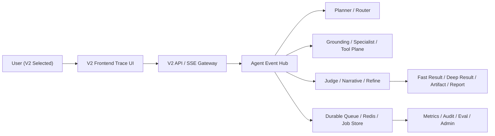

# 企业化 GIS Agent 产品化路线图

> 目标版本：V2.2 -> V2.5
>
> 目标定位：把当前“可运行的混合式 GIS Agent”升级为“企业可上线、可治理、可审计、可恢复、可扩展的 GIS Agent 产品”。

---

## 1. 产品目标

当前 V2 已经基本摆脱“假智能、假 agent”的壳子，但距离企业级产品还有明显差距。下一阶段不再以“再加几个 agent”为主，而以“把 Agent 系统做成企业可信基础设施”为主。

产品化目标分四条主线：

1. 可靠性：任务不丢、状态可恢复、故障可观测、队列可重试。
2. 治理性：模型调用、缓存命中、质量裁决、导出交付都可追踪可控。
3. 业务化：从“问答”升级为“分析工作流”，支持报告、图层、导出、异步任务。
4. 自治性：从单轮 agent 升级到多轮 `plan -> act -> judge -> refine`，并具备跨服务扩展能力。

---

## 2. 当前基线判断

### 已具备

1. V2 已有真实的 LLM Planner、LLM Judge、Narrative Generate/Refine。
2. 已有事件总线和默认 agent 订阅机制。
3. 已有 job snapshot、deep lane、artifact contract、objective contract。
4. 已有 Redis/BullMQ 路径的基础接入能力。

### 仍不足

1. 前端链路可视化仍未形成 V2 专属产品体验。
2. 可靠性控制面仍未形成完整的运维闭环。
3. 评测、审计、租户治理、配额控制还未产品化。
4. 自治回路只有最小闭环，还不是完整的 Agent OS。

---

## 3. 核心产品原则

1. 不再复用 V1 的前端链路样式来表达 V2。
2. 所有“智能”能力必须伴随“可回放、可审计、可度量”能力。
3. 所有长任务必须以 durable job 为单位运行，禁止只存在于内存。
4. 对企业客户，可靠性和治理优先级高于继续堆砌模型能力。

---

## 4. 工作流总览

---

## 5. 五个产品化工作流

## Workstream A：V2 专属前端链路可视化

### 目标

给 V2 单独设计一套“Agent Trace UI”，只在用户明确选择 `v2` 时触发，禁止继续套用 V1 的叙事链路样式。

### 设计要求

1. 只在 `architectureMode === 'v2'` 时渲染。
2. 风格上强调“事件流 + Agent 协作 + 任务态”，而不是 V1 的固定步骤叙事。
3. 展示内容必须来自真实 V2 事件和 job snapshot，不允许前端脑补链路。

### 交付物

1. 新组件：`src/components/v2/V2AgentTracePanel.vue`
2. 新组件：`src/components/v2/V2AgentTraceTimeline.vue`
3. 新组件：`src/components/v2/V2JobInspector.vue`
4. 新状态适配层：从 `fast.result / deep.accepted / deep.patch / deep.final / deep.failed` 和 `/api/v2/jobs/:jobId` 构建 UI state

### 关键交互

1. Agent 卡片：显示当前参与 agent、输入主题、输出主题、耗时、结果状态。
2. Trace 时间线：显示路由、grounding、specialist、judge、refine、artifact 的真实事件序列。
3. Deep lane 队列态：显示 `queued / running / partial / done / failed / resumed`。
4. 审稿回路：显示 `judge downgraded`、`review requested refine`、`refined answer applied`。

### 发布门

1. V1 与 V2 UI 明确分流。
2. V2 UI 不回退使用 V1 Narrative 页面样式。
3. 所有链路节点都能回溯到真实 trace/job 字段。

---

## Workstream B：可靠性与控制面

### 目标

把 V2 从“能跑”升级成“企业可托管”。

### 重点建设

1. Redis/BullMQ 正式进入部署拓扑。
2. Deep lane 支持 retry、dead-letter、resume、queue metrics。
3. 多级缓存形成 `L1 session memory + L2 Redis + degraded memory fallback` 标准模式。
4. 所有 async deep job 都能从 job snapshot 恢复。

### 必做能力

1. 队列监控页：等待数、运行数、失败数、重试数、死信数。
2. 缓存监控页：L1 命中率、L2 Redis 命中率、fallback 命中率、平均 TTL。
3. 故障演练：Redis 不可用、Worker 重启、Node 进程退出、BullMQ 恢复。
4. 回放工具：给定 `job_id / trace_id`，回放关键状态变化。

### 发布门

1. async deep job 在进程重启后可恢复。
2. Redis 不可用时系统降级但不中断主流程。
3. BullMQ 死信任务可人工重放。
4. 有真实运行看板，而不是只靠日志 grep。

---

## Workstream C：治理、评测、审计

### 目标

把“模型驱动的系统”变成“可治理的企业系统”。

### 治理项

1. 模型治理：按 objective/租户/成本进行模型路由策略管理。
2. 配额治理：按用户、租户、任务类型设置 token 和 job 限额。
3. 质量治理：对 planner、judge、narrative、specialist 单独打分。
4. 数据治理：记录 grounding 数据源、artifact 来源、evidence refs。

### 审计项

1. 审计日志必须覆盖：
   - 谁触发了任务
   - 用了哪个模型
   - 触发了哪些 agent
   - 产生了哪些 artifact
   - 为什么降级、为什么 handoff、为什么 refine
2. 审计日志必须支持导出和 retention。

### 评测项

1. 建立离线评测集：
   - 片区快评
   - 热点
   - 机会点
   - 对比
   - 覆盖缺口
   - 导出
   - 无数据
   - 降级与恢复
2. 发布前自动运行评测，不达阈值不允许升版本。

### 发布门

1. 每次发布产出质量报告和成本报告。
2. 审计日志可按 `tenant/user/job/trace` 查询。
3. 评测分数进入发布门禁，而不是人工口头评估。

---

## Workstream D：企业 GIS 工作流化

### 目标

把 V2 从“对话后端”升级为“GIS 分析工作流引擎”。

### 重点建设

1. 支持分析结果生成正式报告，而不是只返回文本。
2. 支持图层交付、GeoJSON 交付、分析任务单交付。
3. 支持批量 AOI、定时任务、异步报告生成。
4. 支持从“问问题”变成“启动任务模板”。

### 关键产品形态

1. `Agent Analysis Job`
2. `Artifact Delivery Job`
3. `Scheduled Monitoring Job`
4. `Batch Region Evaluation Job`

### 交付物

1. 报告模板中心
2. 图层/导出清单页
3. 任务编排模板库
4. 定时分析与监测入口

### 发布门

1. 一个任务至少能产出文本、证据、状态、交付物四类结果。
2. 企业用户可以直接消费结果，不必手工整理 agent 输出。

---

## Workstream E：自治能力升级为强 Agent OS

### 目标

从当前“混合式 Agent 栈”升级为“可协作、可恢复、可治理的强 Agent OS”。

### 演进路径

#### E1. 单轮自治

当前已具备：

`plan -> act -> judge -> refine`

#### E2. 多轮自治

下一步引入：

`plan -> act -> judge -> refine -> replan -> act -> judge`

要求：

1. 有明确的最大轮次，禁止无限循环。
2. 每轮必须写入 job snapshot。
3. 每轮必须有成本与质量增益记录。

#### E3. 跨 Agent 协商

重点：

1. Planner 不只编单条 pipeline，而编多 agent DAG。
2. Specialist 不只返回 section，还返回下一步建议。
3. Judge 可以要求 `replan` 而不是只要求 `rewrite`。

#### E4. 跨服务执行

重点：

1. 把 specialist agent worker 化、服务化。
2. Event Hub 可升级为跨进程 event mesh。
3. 允许热点分析、导出分析、评测分析独立扩缩容。

### 发布门

1. 自治多轮有上限且有收益证明。
2. 不允许用“多轮”掩盖低质量首轮设计。
3. 所有 agent 行为都可追踪可复盘。

---

## 6. 分阶段路线

## Phase V2.2：可靠性与 V2 专属 UI

目标：

1. 上线 V2 专属链路可视化。
2. 接好 Redis/BullMQ。
3. 打通 queue/cache/trace 可观测性。

验收：

1. `architectureMode === 'v2'` 时显示 V2 Trace UI。
2. async deep job 可恢复。
3. Redis/BullMQ 健康状态可观测。

## Phase V2.3：治理与评测

目标：

1. 建立完整质量评测和发布门。
2. 建立成本、模型、质量、artifact 审计。

验收：

1. 有离线评测集和发布报告。
2. 有可查询的审计链路。

## Phase V2.4：企业工作流化

目标：

1. 从“问答”升级到“分析任务产品”。
2. 支持报告、图层、定时、批量分析。

验收：

1. 企业用户可直接消费产出，不需二次整理。

## Phase V2.5：强 Agent OS

目标：

1. 多轮自治。
2. 多 agent DAG。
3. 跨服务执行。

验收：

1. 自治回路有收益证明。
2. 多 agent 跨服务调度可稳定运行。

---

## 7. 核心指标

### 可靠性指标

1. async deep job 恢复成功率
2. queue 死信率
3. job 最终一致性成功率
4. artifact 交付成功率

### 治理指标

1. planner/judge/narrative 评测得分
2. 单任务模型成本
3. 缓存命中率
4. 降级率与 handoff 率

### 产品指标

1. 企业用户任务完成率
2. 报告/导出使用率
3. 批量任务采用率
4. 人工复核介入率

---

## 8. 风险与约束

1. 不能为了“更自治”破坏对外契约稳定性。
2. 不能为了“更企业化”把系统重新做回流程引擎。
3. 前端 V2 Trace UI 必须建立在真实事件之上，禁止视觉造假。
4. 自治增强必须和审计、评测同步推进，不能裸奔上线。

---

## 9. 结论

V2 下一步的重点，不是“再堆更多智能体”，而是：

1. 让 V2 拥有企业级可靠性与控制面。
2. 让 V2 前端表达出真正不同于 V1 的 Agent 协作体验。
3. 让 V2 从问答型后端进化为工作流型 GIS Agent 产品。
4. 最终把 V2 推进为具备多轮自治、跨服务执行、可治理可审计的强 Agent OS。

这条路线才是真正的“企业化 GIS Agent”。
